# Plexi Architecture

> Timeless reference for what Plexi is and how it's structured.
> For current build status and progress, see `DEV_LOG.md` and `git log`.

---

## Vision

One window. Everything else installs into it.

Plexi is a terminal multiplexer that hosts apps. The goal is to eventually be the only app you need — terminals, agents, file explorers, git log viewers, audio tools, AI pipelines — all isolated behind a single protocol (PGAP), all navigable without switching windows.

**The three problems being solved:**
1. **Context** — switching projects means re-establishing context. Plexi keeps it present: directory-scoped workspace state, apps that know the project, agents that read the logs.
2. **Permissions** — agents calling agents calling tools: the chain of trust must be visible. `manifest.toml` + the capability broker makes every permission explicit and auditable.
3. **Interface** — the terminal is already the right place to work. Plexi makes it the only place you need — not by replacing everything, but by being the hub apps install into.

**What makes this safe:** PGAP is the isolation boundary. Apps communicate via newline-delimited JSON over piped stdio — no shared memory, no inherited file descriptors. Capabilities are declared, prompted, and persisted. The long-term enforcement story is WASM (v3.1+ for Rust apps), which closes the OS-level sandbox gap and enables true community distribution.

**The agent dev loop:** an agent can write a Plexi app, spawn it in the test harness, receive a PNG of what it looks like, simulate key presses, and assert on the new frame — all without a running GUI. This is how apps get built and verified at scale.

---

## Target Architecture

```mermaid
flowchart TB
  %% ============ USER / OS ============
  subgraph OS["macOS host"]
    User([User])
    Keychain[("Keychain<br/>(secrets)")]
    FS[("~/.plexi-v3/<br/>apps, events.jsonl, ledger.jsonl,<br/>permissions.json, plexi.log")]
    LLM[["External LLM APIs<br/>Anthropic / Claude CLI"]]
  end

  %% ============ PLEXI HOST ============
  subgraph Host["Plexi host process (Rust)"]
    direction TB

    subgraph Renderer["Renderer layer (egui+wgpu prod · tiny-skia headless CI)"]
      Tiling["Tiling & pane tree<br/>(split H/V, focus, zoom)"]
      Palettes["Palettes & modals<br/>(notifications, runs, capability prompts)"]
      AgentBar["Agent bar<br/>(Ctrl+/ per pane)"]
    end

    subgraph PaneADT["Pane ADT"]
      PTerm["Pane::Terminal<br/>PTY + vt100"]
      PApp["Pane::App<br/>external PGAP child"]
      PAgent["Pane::Agent<br/>Plexi IQ instance"]
    end

    subgraph Core["Core services (HostModel — no egui dependency)"]
      HostModelNode["HostModel<br/>(pure state machine:<br/>commands in → effects out)"]
      Registry["App registry<br/>(manifest.toml scan)"]
      Perms["Capability broker<br/>(permissions.json + prompts)"]
      EventBus["Host event bus<br/>→ events.jsonl"]
      Runs["Run primitive<br/>(RunGet, BlockedOnUser)"]
      Notifs["Notification log<br/>+ rich actions"]
      Secrets["Directory-scoped secret broker<br/>(Keychain keyed by workspace_root)"]
      Pipes["Typed pipes<br/>(JSON + binary side channel)"]
      Media["Media subsystem<br/>(AudioDevice, VideoDecoder,<br/>mock impls for CI)"]
      Groups["Pane groups<br/>(PathChanged / SubscribePath)"]
    end

    subgraph IQ["Plexi IQ (agent orchestration)"]
      IQLoop["Turn loop<br/>(sync, stream_to_channel)"]
      IQBackend["Backend trait<br/>(ClaudeCli / AnthropicApi)"]
      IQLedger["Ledger<br/>→ ledger.jsonl"]
    end
  end

  %% ============ EXTERNAL PROCESSES ============
  subgraph Apps["External app processes (one per Pane::App)"]
    direction LR
    AppPy["Python app<br/>(plexi_sdk.py)"]
    AppRs["Rust app<br/>(plexi-sdk crate)"]
  end

  %% ============ WIRES ============
  User -->|input| Tiling
  Tiling --> PaneADT
  PaneADT --> Core
  PaneADT --> IQ

  PApp <-->|PGAP v3<br/>stdin/stdout NDJSON| AppPy
  PApp <-->|PGAP v3| AppRs

  PAgent --> IQLoop
  IQLoop --> IQBackend
  IQBackend -->|HTTPS / subprocess| LLM
  IQLoop --> IQLedger
  IQLedger --> FS

  Apps -.draw commands.-> PApp
  PApp -.capability req.-> Perms
  Perms -->|prompt| Palettes
  Perms --> FS
  Apps -.SecretGet<br/>(workspace_root-scoped).-> Secrets
  Secrets --> Keychain
  Apps -.RunGet.-> Runs
  Runs --> Notifs
  Notifs --> Palettes
  Apps <-.typed pipe<br/>JSON or binary.-> Pipes
  Apps <-.audio PCM / video frames.-> Media
  Media --> Pipes
  Apps -.PathChanged.-> Groups
  Groups -.broadcast.-> Apps

  PaneADT -->|emit| EventBus
  IQ -->|emit| EventBus
  Perms -->|emit| EventBus
  Runs -->|emit| EventBus
  EventBus --> FS

  Registry --> FS
```

### Pane ADT

| Variant | What it hosts | Protocol |
|---|---|---|
| `Terminal` | PTY + shell | vt100 bytes |
| `App` | External PGAP child process | PGAP v3 (NDJSON + typed pipes) |
| `Agent` | Plexi IQ instance (LLM turn loop) | internal, streams to UI |

The ADT is frozen. Adding a variant requires a spec amendment. Things that look like new pane types (browser, Excalidraw, canvas) are PGAP apps — not host variants.

### PGAP

Newline-delimited JSON over a child process's stdin/stdout. **Host → app:** `PlexiEvent` (init, render, input, capability decision, secret value, run update, pipe message, path changed, suspend/resume, shutdown). **App → host:** `DrawCommand` (frame primitives, `VideoPlayer`, `AudioPlay`, `AudioCapture`, log, capability request, `SecretGet`, `RunGet`, `Notify`, `PipeOpen`, `PipeSend`, `StatusSummary`, `FrameDone`). Binary payloads travel on typed pipes, not stdio. Full spec: [`docs/pgap-reference.md`](docs/pgap-reference.md).

### Capability model

Every app declares capabilities in manifest.toml. At runtime, any command that needs one is checked against permissions.jsonl. Undeclared capabilities queue a modal prompt; decisions persist.

### Directory-scoped secrets (hard invariant)

Secrets are keyed by `(workspace_root, secret_key)` in Keychain. A secret granted in `/foo` is not readable by any app at any other `workspace_root` without a new brokered prompt. Host validates `workspace_root` against the pane's actual CWD at spawn — apps cannot escalate by lying.

### HostModel (no egui)

All host business logic lives in `HostModel` — a pure state machine with zero egui dependency. Commands in, effects out. The renderer (egui in prod, tiny-skia headless in CI) reads state and paints; it never owns business logic.

### Event bus

Append-only `events.jsonl`. One `HostEvent` enum: app spawn/close, permission decision, secret prompt/deny, run lifecycle, notification + action invoke, agent turn, pipe open/close.

### Media subsystem

Host owns the audio device and video decoder. Apps send declarative commands (`AudioPlay`, `AudioCapture`, `VideoPlayer`). Raw PCM and video frames flow over binary typed pipes — length-prefixed frames on a dedicated unix socket, never stdio. Mock devices (`PLEXI_AUDIO=mock://`, `PLEXI_VIDEO=mock://`) make the whole subsystem headless and CI-testable.

### Pane groups

Apps opt into a named group at spawn. `PathChanged { cwd }` broadcasts to everyone in the group. Apps do not know about each other — only the group name.
