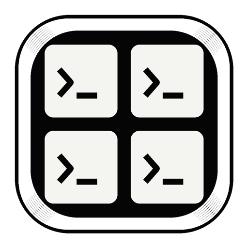
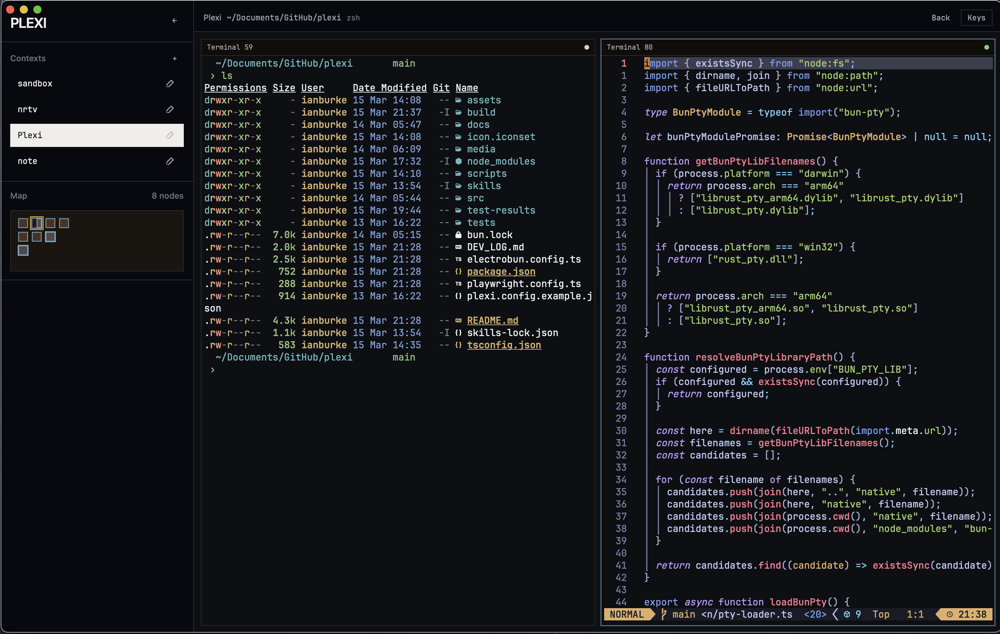
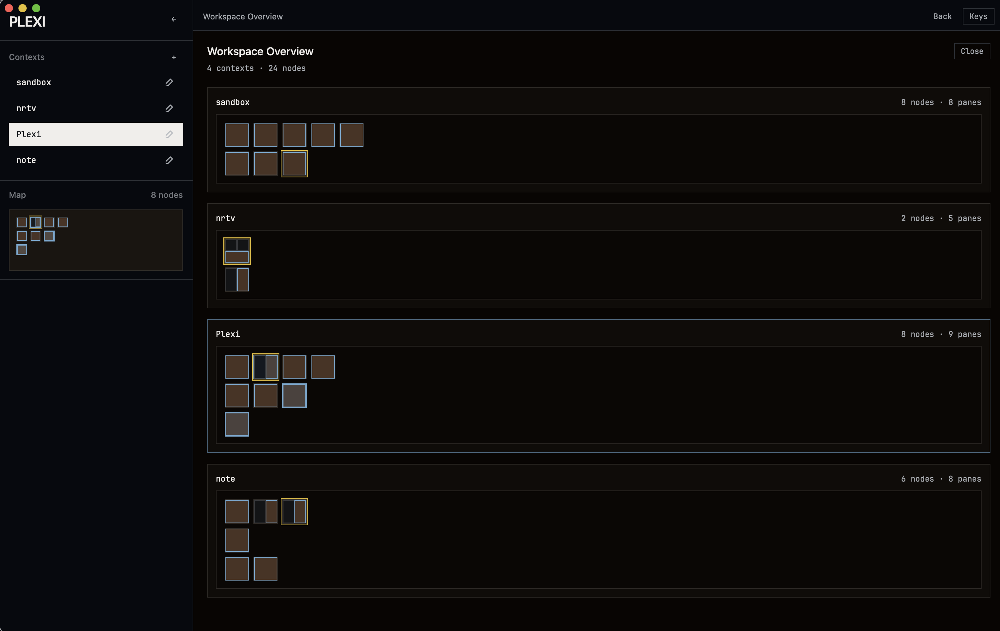

<p align="center">
  
</p>

<h1 align="center">Plexi</h1>

<p align="center">An experiment in spatial terminal window management.</p>

<p align="center">
  
  &nbsp;
  
</p>

<p align="center"><em>basically tmux for omarchy babes</em></p>

**Tested on Mac only** — Linux may work but hasn't been tested.

Loosely inspired by [this rant](https://www.youtube.com/watch?v=EUE8N6mqtGg) — although I've been dreaming of something similar for years.

---

## Quick Start

1. **New pane right** — `Cmd+N` / **New pane below** — `Cmd+Shift+N`
2. **Navigate panes** — `Cmd+Arrow` or `Cmd+H/J/K/L`
3. **Switch contexts** — `Cmd+Opt+1`, `Cmd+Opt+2`, etc.

Your layout and working directories are saved automatically to `~/.plexi/` — pick up where you left off.

---

## The Present

*   **Infinite 2D canvas** — terminals arranged on a spatial grid, navigable with arrow keys or vim-style `h/j/k/l`
*   **Contexts** — named workspaces to separate projects; cycle between them with `Cmd+[` and `Cmd+]`, rename or delete on the fly
*   **Sidebar & minimap** — visual overview of your layout; click nodes to jump to a terminal
*   **Overlay minimap** — toggleable full-canvas map (`Cmd+M`)
*   **Terminal management** — open new terminals to the right (`Cmd+N`) or below (`Cmd+Shift+N`), close with `Cmd+W`
*   **Workspace persistence** — layout, context, and working directories saved to `~/.plexi/workspaces/`
*   **Shell integration** — automatic cwd tracking via OSC 7 (ZDOTDIR injection for zsh); split panes and workspace restores open in the correct directory
*   **Copy/paste** — selection-aware clipboard support
*   **Font zoom** — `Cmd++/−` to adjust terminal font size
*   **Keyboard reference** — `Cmd+/` to show all shortcuts
*   **Ghost slot hints** — empty adjacent slots show shortcut hints when the canvas is sparse
*   **Status toolbar** — shows current context, working directory, and active process name
*   **WebGL renderer** — GPU-accelerated xterm.js rendering for accurate colors in TUI apps

## The Future

*   **True Session Persistence and Multiplexing**: A headless daemon so underlying PTYs and SSH connections stay alive in the background when you close the UI. (SSH auto-connect, connection pooling)
*   **Coding Agent Support**: Session labels, awaiting-response indicators, and notifications — so you can run multiple agents across panes without babysitting them.
*   **Other Node Types**: Embedding full web browsers and Excalidraw whiteboards directly on the canvas alongside the terminals.
*   **Support Multiple Workspaces**: Add the ability to switch between whole families of contexts (might be overkill)
*   **libghostty Integration**: Swap out `xterm.js` for `libghostty` to get GPU-accelerated, native-grade terminal rendering.
*   **Ergonomics**: Vi-style copy mode and scrollback buffers. (as well as many other Vim style interactions on the canvas)
*   **Pane Management**: Considering tmux-style split pane management within a single canvas node.
*   **Scriptable Layouts**: tmuxinator-style named layouts that open split panes with specific commands pre-launched (e.g. "dev stack" = frontend + backend side-by-side).

---

## Known Issues

*   **opencode visually bugs sometimes.**
*   No SSH support yet (planned alongside session persistence).
*   **Shell integration is zsh-only** — bash/fish cwd tracking not yet implemented (fish has OSC 7 built-in, bash script coming later).

---

## Development

Built with [Tauri](https://tauri.app/) (Rust backend, WebView frontend).

```bash
# Install JS dependencies
npm install

# Start dev server (hot reload)
npm run dev

# Build release app
npm run build
```

The dev server runs the frontend with Vite and launches the Tauri WebView pointing at it. The release build produces a native `.app` in `src-tauri/target/release/bundle/`.

---
