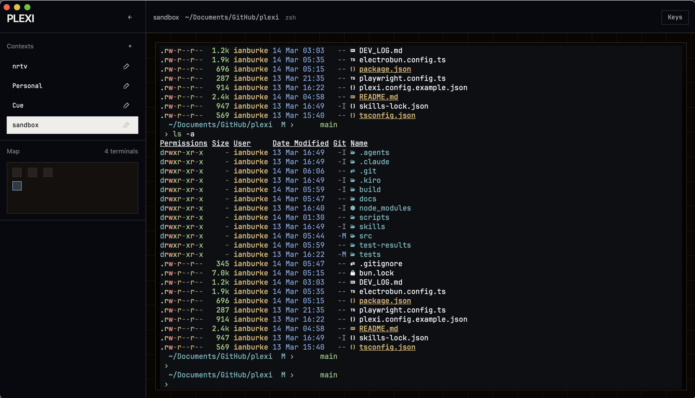

# Plexi



An exploration in spatial terminal window management. I'm building this for people who haven't learned `tmux` but want to become terminal super users. 

Instead of memorizing obscure keybindings to manage split panes, Plexi uses an infinite 2D canvas. You organize your dev environment using spatial memory—placing servers, tail logs, and build tasks exactly where they make sense to you. My goal is to refine this spatial canvas into a core primitive that is as versatile as possible.

Built with **Electrobun** (Bun + WebView) and **xterm.js** (for now).

---

## Current Scope (The MVP)

Right now, I'm just focused on getting a functional frontend window manager working:

*   **Infinite 2D Viewport**: Pan and zoom around your terminal nodes.
*   **Spatial Keyboard Navigation**: Jump between terminals based on their X/Y coordinates.
*   **Terminal Panels**: Basic interactions powered by `xterm.js`.
*   **Layouts**: Save and load your visual arrangement to a JSON config. You can edit the `session.json` file directly in `~/.config/plexi/session.json` (or your OS equivalent). I have plans to expose this editing capability directly in the app at some point.

## The Future (Replacing `tmux`)

Once the basic canvas feels good, the plan is to build the backend daemon features that actually make this a `tmux` alternative.

*   **True Session Persistence**: A headless daemon so underlying PTYs and SSH connections stay alive in the background when you close the UI.
*   **libghostty Integration**: I plan to eventually swap out `xterm.js` for `libghostty` to get GPU-accelerated, native-grade terminal rendering.
*   **Other Node Types**: Embedding full web browsers and Excalidraw whiteboards directly on the canvas alongside your terminals.
*   **Advanced Multiplexing**: SSH auto-connect, connection pooling, and visual routing lines showing relationships between nodes.
*   **Ergonomics**: Vi-style copy mode and scrollback buffers.

---

## Known Issues

*   **Graphics rendering isn't great:** `xterm.js` is okay for now, but this will be fixed with the planned migration to `libghostty`.
*   **opencode visually bugs sometimes.**

---

## Development

```bash
# Install dependencies
bun install

# Start dev server
bun run dev

# Build for production
bun run build

# Run Playwright e2e verification (ALWAYS RUN BEFORE COMMITS)
bun run test:e2e
```

---

Loosely inspired by [this rant](https://www.youtube.com/watch?v=EUE8N6mqtGg) — although I've been dreaming of something similar for years.