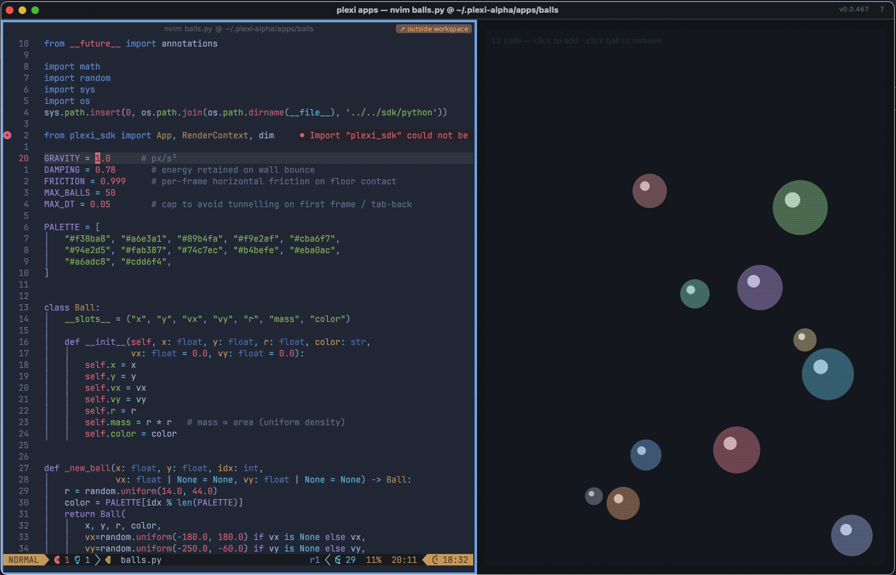

<h1 align="center"> under construction </h1>

> **Pre-release:** Plexi is pre-v1 and under active development. APIs, config format, and behavior may change without notice.

<p align="center">
  
</p>

<h1 align="center">plexi</h1>

<p align="center">The last app you'll ever need.</p>

<p align="center">
  
  
</p>

Started as a terminal multiplexer. Got carried away. Now it's closer to a micro operating system — file explorer, notes editor, agent hooks, app runtime/SDK, notifications, and probably more I'm forgetting. Built in Rust.


---

## Contact

If you run into any issues, don't hesitate to reach out directly: adhdisntreal@gmail.com

---

## Install

> **macOS only.** Linux is untested.

### One-liner

```bash
curl -fsSL https://plexiapp.com/install | sh
```

Downloads the latest release, installs to `/Applications`, sets up the `plexi` CLI, and wires ZSH integration. Restart your terminal when done.

First run:

```bash
plexi ai onboard
```

This guides AI setup with local Ollama, a user-owned OpenRouter key, or a skip-for-now path, then points you at the next app install command.

To install a pre-release channel, pass `--channel`:

```bash
curl -fsSL https://plexiapp.com/install | bash -s -- --channel beta
curl -fsSL https://plexiapp.com/install | bash -s -- --channel alpha
```

**First launch (unsigned app):** macOS may block it on first open.
- **macOS 15+:** System Settings → Privacy & Security → "Open Anyway".
- **Or:** `xattr -cr /Applications/Plexi.app && open /Applications/Plexi.app`

### Manual

1. Download the latest `Plexi-vX.Y.Z.zip` from [Releases](https://github.com/ianjamesburke/PLEXI/releases).
2. Unzip and move `Plexi.app` to `/Applications`.
3. Run `xattr -cr /Applications/Plexi.app` if macOS blocks it.
4. On first launch, click **Install CLI** in the setup prompt to add `plexi` to your PATH.

### Build from source

Needs Rust ([rustup.rs](https://rustup.rs)).

```bash
just install
```

---

## Quick Note (`Cmd+0`)

Quick Note is a global capture modal for routing text to any destination without breaking your flow.

**Opening it:** `Cmd+0` from anywhere in Plexi opens the compose modal. Type your note, press `Enter` to advance to the destination picker, then press a digit key to route instantly — no second `Enter` needed.

**Destination 0** (global backlog) is always available regardless of config. It saves notes to `~/.plexi/backlog/` as timestamped Markdown files.

**Custom destinations** are configured in `[[quick_note.destinations]]` in your `config.toml`. Each destination gets a digit key (`1`–`9`) and a label shown in the picker.

### Destination types

**`backlog`** — writes the note as a Markdown file into a directory.

```toml
[[quick_note.destinations]]
key   = 1
label = "Backlog"
type  = "backlog"
path  = "~/.plexi/backlog"
```

**`pane`** — runs a shell command template in a new pane. Use `{note}` and `{cwd}` as tokens; both are shell-escaped before substitution.

```toml
[[quick_note.destinations]]
key      = 2
label    = "Ask Claude"
type     = "pane"
command  = "claude -p {note}"
position = "context-end"
```

The `position` field controls where the new pane opens:
- `context-end` — appended at the end of the current context
- `context-start` — inserted at the start of the current context
- *(omitted)* — splits the focused pane

**Submenus** — omit `type` and set `options = [...]` to expand into a sub-picker on keypress:

```toml
[[quick_note.destinations]]
key   = 3
label = "GitHub issue"
options = [
  { key = 1, label = "Bug",         command = "cd {cwd} && gh issue create --label bug --title {note} --body {note}" },
  { key = 2, label = "Enhancement", command = "cd {cwd} && gh issue create --label enhancement --title {note} --body {note}" },
  { key = 3, label = "No label",    command = "cd {cwd} && gh issue create --title {note} --body {note}" },
]
```

**Security:** Only `{note}` and `{cwd}` are shell-escaped. Do not interpolate other user-supplied values into command templates — they will not be escaped and are a shell injection risk.

---

## Notifications

Any process running inside Plexi — a terminal command, an app, or the CLI — can emit a notification. The notification bus routes events across panes so independent processes can communicate.

### Emitting a notification

**From the CLI:**

```bash
plexi notify --title "Job done" --body "Output is ready in ~/out.txt"
```

**With action choices:**

```bash
plexi notify --title "Deploy ready" --body "Review before promoting." \
  --choice "a:Open PR" \
  --choice "b:Skip"
```

**From an app (Python SDK):** emit a notification by returning a `Notify` effect from `update`. See [`sdk/python/SDK_V3.md`](sdk/python/SDK_V3.md) for the current effect API.

### Priority tiers

| Priority | Value | Behavior |
|----------|-------|----------|
| `PRIORITY_LOW` | 0 | Queues silently; badge ticks on toolbar |
| `PRIORITY_NORMAL` | 50 | Queues silently by default |
| `PRIORITY_HIGH` | 100 | Auto-opens the modal (default threshold) |
| `PRIORITY_CRITICAL` | 200 | Always interrupts |

The `interrupt_threshold` in `config.toml` sets the minimum priority that auto-opens the modal. Notifications below it queue silently — open `Cmd+Shift+A` to review.

### The notification modal (`Cmd+Shift+A`)

Keyboard-first navigation: `Enter` confirms / acknowledges, `j`/`k` or `↑`/`↓` cycles choices, `1`–`9` for direct selection, `Esc` defers (modal closes, notification stays in queue). Notifications with `required = true` cannot be deferred with `Esc`.

A toolbar badge shows the count of pending notifications. `Cmd+Shift+A` always gives feedback — if the queue is empty, a brief empty-state card appears.

---

## Apps

Apps run as sandboxed WASM components (Python apps run inside a CPython-in-WASM adapter; Rust apps compile natively to the same component model). They declare capabilities in a manifest; the host enforces those capabilities and prompts on first use of an undeclared one.

A fresh install seeds a core set of apps automatically. Browse them with `Cmd+P` or manage them from the terminal.

Any CLI can also get a rendered Plexi UI without writing an app — see the [CLI Descriptor Authoring Guide](registry/CLI_DESCRIPTOR_GUIDE.md).

### Install an app

```bash
plexi install <id>                         # from the registry
plexi install github:owner/repo            # any public git repo
plexi install git+https://example.com/repo.git    # explicit git URL
plexi install --pack path/to/pack.toml     # apply a whole pack at once
```

Registry IDs resolve against the [Plexi app registry](https://github.com/ianjamesburke/plexi-app-registry). Git URLs clone the repo directly — no registry needed.

### Manage installed apps

```bash
plexi list                    # show all installed apps and versions
plexi uninstall <id>          # remove an app
plexi update apps             # update all installed apps
plexi update apps <id>        # update a specific app
plexi validate <path>         # validate a manifest before publishing
```

### Scaffold an app

```bash
plexi app init my-app
```

Creates a Plexi app directory with `manifest.toml` and `main.py` without opening it. Pass `--open` to launch it in a split-right pane after scaffolding. Inside a workspace it goes under that workspace's channel app directory; outside a workspace, pass `--global` to install into the global app registry. The host injects the SDK at launch.

**Minimal `manifest.toml`:**

```toml
schema_version = 1

[app]
id = "my-app"
type = "app"
name = "My App"
entry = "main.py"
version = "0.1.0"
description = "What this app does"

[app.capabilities]
capabilities = []   # e.g. ["fs.read", "ai.query", "secrets.get"]
```

### App interaction model

Apps are three module-level functions. The host calls `init` once on launch, `update` for every input event, and `view` after any state change. No class, no inheritance.

```python
from plexi_sdk import state, log
from plexi_sdk.effects import SetState, SetTitle
from plexi_sdk.events import KeyEvent
from plexi_sdk.ui import AppBar, Column, Text, FooterKeys


def init(size, args):
    log.info("my-app initialized")
    return [SetTitle("My App"), SetState({"count": 0})]


def update(event):
    if isinstance(event, KeyEvent) and event.pressed:
        if event.key in ("equals", "plus"):
            return [SetState({"count": state.get("count", 0) + 1})]
        if event.key == "minus":
            return [SetState({"count": state.get("count", 0) - 1})]
    return []


def view():
    return Column([
        AppBar("My App"),
        Text(str(state.get("count", 0)), bold=True),
        FooterKeys([("+", "increment"), ("-", "decrement")]),
    ], grow=True)
```

`init` returns effects applied before the first frame. `update` returns effects in response to events — `SetState` mutates process-local runtime state; `PersistState` also writes through to the host. `view` is pure and reads state via `state.get()`.

Use canvas apps (`on_render`) only for pixel-control surfaces like games or realtime visualizations.

For host-brokered actions, return the appropriate effect from `update`: `Notify(...)`, `SecretGet(...)`, `AiQuery(...)`. Full reference: [`sdk/python/SDK_V3.md`](sdk/python/SDK_V3.md).

App logs forward into the host log tagged `app::<app_id>`. Check `~/.plexi/plexi.log` (or `~/.plexi-alpha/plexi.log` on alpha) when debugging.

To share your app: push the repo to GitHub, then anyone can install it with `plexi install github:you/your-app`. To add it to the public registry, open a PR against [plexi-app-registry](https://github.com/ianjamesburke/plexi-app-registry).

---

## App runtime — WASM components

Every Plexi app — built-in or third-party — runs as a WASM component: one `wasmtime::Store` per app pane, exporting `lifecycle.init`, `lifecycle.update`, and `lifecycle.view`. The host renders the returned UI tree, delivers input events, and executes returned effects (`file-read`, `http-fetch`, `ai-query`, `request-capability`, and more). Components have isolated linear memory and only the host interfaces Plexi links — an app can't reach outside its granted capabilities by construction, not by convention.

**Binary data** (audio PCM, video frames, raw bytes) travels on **typed pipes** — Unix sockets opened by the host on demand, separate from the component effect interface.

Full current runtime reference: [`docs/wasm-runtime.md`](docs/wasm-runtime.md). Python SDK authoring reference: [`sdk/python/SDK_V3.md`](sdk/python/SDK_V3.md) (being reconciled with the WASM runtime — see `sdk/python/SDK_V3.md`'s own status note).

---

## Secrets management *(in development)*

Workspace-scoped secrets store credentials in the macOS Keychain. Secrets use canonical environment-variable names (`OPENROUTER_API_KEY`, `OPENAI_API_KEY`, etc.) as their primary identity. A workspace value wins over a global fallback value — two workspaces can hold different values for the same key.

**CLI:**

```bash
plexi secret set <KEY>          # prompt for value, store in Keychain
plexi secret get <KEY>          # retrieve (requires workspace context)
plexi secret list               # list keys scoped to current workspace
plexi secret delete <KEY>       # remove from Keychain
```

**From an app**, request the `secrets.get` capability in the manifest. The SDK effect API for secret access is documented in [`sdk/python/SDK_V3.md`](sdk/python/SDK_V3.md).

The host presents a permission prompt on first access; subsequent calls within the same session use the cached grant.

Terminal injection — automatically placing selected secrets into new PTY pane environments — is in active development. Configure which keys are injected via `terminal.env.inject` in your workspace `secrets.toml`.

---

## CLI reference

All `plexi` subcommands work identically on alpha, beta, stable, and PR builds. `PLEXI_SOCKET` (set inside a Plexi pane) routes host commands to the correct running instance automatically.

| Command | Description |
|---------|-------------|
| `plexi install <id>` | Install an app from the registry or a git URL |
| `plexi uninstall <id>` | Remove an installed app |
| `plexi update apps [id]` | Update all apps, or a specific one |
| `plexi list` | List all installed apps and their versions |
| `plexi validate <path>` | Validate an app directory's manifest |
| `plexi pack` | Pack management (apply, list packs) |
| `plexi app init <name>` | Scaffold a new app in the current directory |
| `plexi app open <app-id>` | Open an app pane |
| `plexi pane new [cmd]` | Open a terminal pane, optionally running a command |
| `plexi pane <subcommand>` | Pane management (name, close, list, focus) |
| `plexi notify` | Emit a notification (see Notifications section) |
| `plexi context` | Query or set the active workspace context |
| `plexi workspace` | Workspace management (init, status) |
| `plexi secret` | Secret management (set, get, list, delete) |
| `plexi run <name>` | Run a named command from the registry |
| `plexi completions <shell>` | Output shell completions (zsh, bash, fish) |

---

## Tiling layout

Split panes, navigate, and zoom with keyboard shortcuts. Press `Cmd+/` for the full shortcut list at any time.

| Shortcut | Action |
|----------|--------|
| `Cmd+D` | Split horizontally |
| `Cmd+Shift+D` | Split vertically |
| `Cmd+H/J/K/L` | Navigate between panes |
| `Cmd+Ctrl+K` | Send pane to the front |
| `Cmd+Ctrl+J` | Send pane to the back |
| `Cmd+Enter` | Zoom focused pane full-screen |
| `Cmd+W` | Close focused pane |
| `Cmd+P` | Command palette |
| `Cmd+T` | New tab |
| `Cmd+N` | New page (right) |
| `Cmd+R` | Rename pane |
| `Cmd+[` / `Cmd+]` | Focus history — back / forward |

---

## Development

```bash
just dev          # cargo run
just build        # cargo build --release
just install      # build + install to /Applications and /usr/local/bin
```

Built with Rust, [egui](https://github.com/emilk/egui), and [egui_term](https://github.com/niceda/egui_term).

---

## Contact

ADHDISNTREAL@GMAIL.COM
