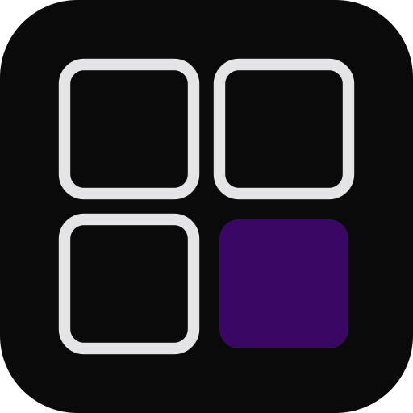

<p align="center">
  
</p>

<h1 align="center">Plexi</h1>

<p align="center">An experiment in spatial terminal window management.</p>

<p align="center">
  
</p>

<p align="center"><em>basically tmux for omarchy babes</em></p>

**Mac only** — Linux may work but hasn't been tested.

Loosely inspired by [this rant](https://www.youtube.com/watch?v=EUE8N6mqtGg) — although I've been dreaming of something similar for years.


---

## Quick Start

### Download (recommended)

1. Grab the latest `Plexi-vX.Y.Z.zip` from [Releases](https://github.com/ianjamesburke/PLEXI/releases)
2. Unzip and move `Plexi.app` to `/Applications`
3. On first launch, macOS will block the app because it's unsigned. To allow it:
   - **macOS 14 and earlier:** Right-click `Plexi.app` → Open → confirm
   - **macOS 15 (Sequoia)+:** Go to System Settings → Privacy & Security → scroll down and click "Open Anyway"
   - **Terminal shortcut (any version):** `xattr -cr /Applications/Plexi.app`

### Build from source

Requires Rust — install via [rustup.rs](https://rustup.rs) if you don't have it.

```bash
curl -fsSL https://raw.githubusercontent.com/ianjamesburke/PLEXI/main/install.sh | bash
```

Builds `Plexi.app` and installs it to `/Applications`. Launch from Spotlight, Dock, or Finder.

## Keyboard Shortcuts

| Action | Shortcut |
|---|---|
| Split right | `Cmd+D` |
| Split below | `Cmd+Shift+D` |
| Navigate panes | `Cmd+H/J/K/L` |
| Close pane | `Cmd+W` |
| New tab | `Cmd+T` |
| Cycle tabs | `Cmd+]` / `Cmd+[` |
| Switch context | `Cmd+1..9` |
| Toggle sidebar | `Cmd+B` |
| Zoom pane | `Cmd+Enter` |
| Show shortcuts | `Cmd+/` |
| Quit | `Cmd+Q` |

---

## The Present

*   **Tiling terminal panes** — split, navigate, zoom, and tab-stack with keyboard shortcuts
*   **Contexts** — named workspaces to separate projects; rename, reorder, or delete on the fly
*   **Workspace persistence** — layout, contexts, and working directories saved to `~/.plexi/`; pick up where you left off
*   **Catppuccin Mocha theme** — dark, easy on the eyes

## The Future

*   **True Session Persistence and Multiplexing**: A headless daemon so underlying PTYs and SSH connections stay alive in the background when you close the UI. (SSH auto-connect, connection pooling)
*   **Coding Agent Support**: Session labels, awaiting-response indicators, and notifications — so you can run multiple agents across panes without babysitting them.
*   **Minimap**: A spatial overview of your layout — click nodes to jump to a terminal. Was prototyped and removed; will come back as a real interactive feature once pane navigation warrants it.
*   **Other Node Types**: Embedding full web browsers and Excalidraw whiteboards directly on the canvas alongside the terminals.
*   **libghostty Integration**: Swap out the current terminal renderer for `libghostty` to get GPU-accelerated, native-grade terminal rendering.
*   **Ergonomics**: Vi-style copy mode and scrollback buffers, font zoom, selection-aware copy/paste. (as well as many other Vim-style interactions on the canvas)
*   **Pane Management**: Considering tmux-style split pane management within a single canvas node.
*   **Scriptable Layouts**: tmuxinator-style named layouts that open split panes with specific commands pre-launched (e.g. "dev stack" = frontend + backend side-by-side).

---

## Development

Built with Rust, [egui](https://github.com/emilk/egui), and [egui_term](https://github.com/niceda/egui_term) (forked for cursor fixes).

```bash
just dev     # cargo run
just build   # cargo build --release
just install # build + install to /Applications and /usr/local/bin
```

hi
