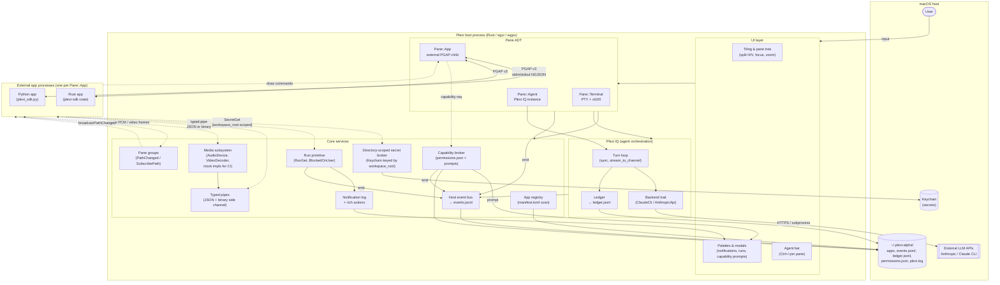

# State of Plexi

> Single source of truth for what Plexi is, what's shipped, what's half-built, and what's next.
> **v3.0 is the active target.** v2.x on `alpha` is frozen as `v2-last` and retired — see [`docs/specs/releases/plexi-v3.0.md`](docs/specs/releases/plexi-v3.0.md) for the clean-cut spec.
> Diagram below is the **v3.0 target architecture**. Reality section tracks what survives the port.

---

## 1. Target Architecture (v3.0)

The v3.0 shape. Clean cut from v2.x — no fractal/recursion, no `Pane::Embedded`, no portals, no OpenIntent-as-spec'd. See the full spec at [`docs/specs/releases/plexi-v3.0.md`](docs/specs/releases/plexi-v3.0.md).

### Pane modes (the ADT)

| Variant | What it hosts | Protocol |
|---|---|---|
| `Terminal` | PTY + shell | vt100 bytes |
| `App` | External PGAP child process | PGAP v3 (NDJSON + typed pipes) |
| `Agent` | Plexi IQ instance (LLM turn loop) | internal, streams to UI |

### PGAP — Plexi Generic App Protocol (brief)

Newline-delimited JSON over a child process's stdin/stdout. **Host → app:** `PlexiEvent` (init, render, input, capability decision, secret value, run update, pipe message, path changed, suspend/resume, shutdown). **App → host:** `DrawCommand` (frame primitives, `VideoPlayer`, `AudioPlay`, `AudioCapture`, log, capability request, `SecretGet`, `RunGet`, `Notify`, `PipeOpen`, `PipeSend`, `StatusSummary`, `FrameDone`). PGAP is the isolation boundary — no shared memory, no inherited FDs. Binary payloads (audio PCM, video frames, arbitrary bytes) travel on typed pipes, not stdio.

### Capability model

Every app declares capabilities in `manifest.toml`. At runtime, any draw command that needs one (`fs.read/write`, `net.http`, `secrets.get`, `audio.record/playback`, `video.playback`, `pipe.open`, `spawn.app`) is checked against `permissions.json`. Undeclared capabilities queue a modal prompt; decisions persist.

### Directory-scoped secrets (hard invariant)

Secrets are keyed by `(workspace_root, secret_key)` in Keychain. A secret granted in `/foo` is not readable by any app in any sibling or child directory without a new brokered prompt. Host validates the declared `workspace_root` against the pane's actual CWD at spawn — apps cannot escalate by lying.

### Event bus

Append-only `events.jsonl`. One `HostEvent` enum: app spawn/close, permission decision, secret prompt/deny, run lifecycle, notification + action invoke, agent turn, pipe open/close.

### Media subsystem

Host owns the audio device and video decoder. Apps send declarative commands (`AudioPlay`, `AudioCapture`, `VideoPlayer`). Raw PCM and video frames flow over **binary typed pipes** — length-prefixed frames on a dedicated unix socket, never stdio. Host audio thread stays realtime-safe; pipe drain runs on a separate thread with drop-oldest backpressure on overrun.

Mock devices (`PLEXI_AUDIO=mock://in.wav,out.wav`, `PLEXI_VIDEO=mock://fixture.mp4`) make the whole subsystem headless and CI-testable.

### Pane groups

Apps opt into a named group (`"cwd"`, `"selection"`, etc.) at spawn. `PathChanged { cwd }` broadcasts route to everyone in the group. File explorer + terminal stay in sync without knowing about each other.

---

## 2. What survives the port from v2.x

v3 is a clean-cut rewrite on a new `v3` branch off `main`. Not an in-place upgrade. These v2.x pieces are ported forward:

- Pane ADT (finished properly, not PR1-of-3).
- Capability broker + `permissions.json` + runtime prompts.
- Event bus skeleton (`events.jsonl` writer, `HostEvent` enum).
- Run primitive + Run palette.
- Rich notifications (with all action types wired).
- Secret broker — **rebuilt with directory-scoped invariant** (was `app_id`-keyed in v2).
- Typed pipes — extended with binary mode.
- Plexi IQ backend trait + turn loop + ledger — wired into `Pane::Agent` from commit #1.
- Python SDK v0.3.0 → v0.4.0 with new media + pipe helpers.

### Dropped, not ported

Fractal PGAP (all of it), `Pane::Embedded`, `plexi --embedded` mode, `DepthTransition`, `TreeStatus`, portals, OpenIntent-as-v2-spec'd, `agent_llm.rs`, `notification_palette.rs` backlog scanner (becomes `quick-note` app), all v2.x example apps except what's listed in §11 of the v3 spec.

---

## 3. Critical path to v3.0

1. Tag current `alpha` as `v2-last`. Freeze.
2. Branch `v3` off `main`.
3. Port Pane ADT (properly, no PR1-of-3 intermediate).
4. Port capability broker + `permissions.json`.
5. Rebuild secret broker with directory-scoped Keychain keys. Enforce `workspace_root` validation at spawn.
6. Port event bus; wire all `HostEvent` variants with actual emit sites.
7. Port Plexi IQ (backend + loop + ledger) into `Pane::Agent` live, not dead-code.
8. Port typed pipes; add binary-mode side channel over unix socket.
9. Build media subsystem: `AudioDevice` / `VideoDecoder` traits, mock impls for CI. **CoreAudio + AVFoundation prod impls deferred to v3.1** (issues #277, #278) — the traits and mocks are wired, example apps run headless through mocks, and the prod stubs are clean `Err(NotImplemented)` returns behind the `PLEXI_AUDIO` / `PLEXI_VIDEO` env toggle. No real mic/decoder in v3.0.
10. Build pane groups + `PathChanged` broadcast.
11. Build five example apps: `snake`, `wikipedia`, `todo`, `audio-recorder`, `video-player`.
12. Build `quick-note` first-party app; delete host-internal backlog scanner.
13. CI gate: full protocol test harness green with mocked audio + video.
14. `v3` → `beta` → `main`. Tag `v3.0.0`.

Everything outside this list is post-v3. Parked proposals (`spatial-canvas`, `wasm-pwa-deployment`, `sync-architecture`, `agent-replay-testing`) are research, not commitments.
