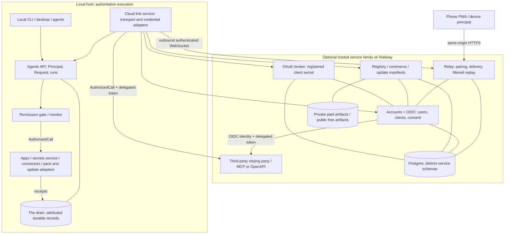

Status: active
Stint: none yet

# Plexi cloud layer

## Contract and ownership

One optional connective layer joins a local Plexi host to phones, accounts,
connectors and distribution. It never becomes the host's authority or execution
engine. Local use, local packages and installed apps remain usable without it.
This is the companion to [Agents API and one permission gate](agents-api-and-permission-gate.md),
which owns Principal, device principal, run token, Request, permission
gate/monitor, AuthorizedCall, and the drain. Those nouns retain that meaning.
All new types, endpoints, policies and acceptance tests here are **proposed**.

The agents spec owns local authorization, intake, supervision and record schemas.
This spec owns cloud transport, credential/resource adapters and distribution
integration. It does not copy the Agents API or introduce a second grant store.
The [authority model](../assistant-authority-model.md) continues to own native
worker confinement and secret-injection isolation; C3 integrates that boundary.

| Owning document | Relationship |
|---|---|
| [Hosted marketplace](../marketplace-hosted.md) | Retains catalog, package validation and review policy; this companion supplies cloud/gate integration. |
| [Marketplace monetization](../marketplace-monetization.md) | Retains commerce policy and entitlement semantics; no new prices or payment launch here. |
| [App framework](../app-framework-marketplace.md) | Retains runtime/package contract; workflow and shell-pack additions below declare requested access only. |
| [Distribution](../../scripts/DISTRIBUTION.md) | Retains installation, immutable generations, receipts, channel selection and rollback; C7 adds signed discovery metadata. |
| [Release channels](../../scripts/RELEASE_CHANNELS.md) | Owns channel names, profiles, tier policy and promotion. |
| [Testing](../../src/testing/TESTING.md) | Owns implementation validation, harness/scene split and visual review. |

The external cloud-assistant proposal dated 2026-10-04 is design provenance.
Its P4 decisions are restated here: HTTPS phone client, outbound authenticated
host link, expiring single-use pairing confirmed on desktop, revocation, rate
limits, reconnect and explicit offline status. Its P6 decisions remain a later
local lifecycle qualification: bundled daemon, single owner, restart fencing,
explicit continue-after-close, and no-display/no-GPU evidence. Its §10 single
writer and recovery requirements and §11 accessible phone UI inform C1 below.
C1–C8 here neither renumber the agents spec's P1–P5 nor authorize cloud P7.

## Evidence snapshot: what exists

Source inspected in this worktree at `4bbb1bf2`; `file:line` citations are the
requested review snapshot, with symbols for future navigation. **BUILT** means
an implementation exists, not that it was run, deployed or qualified here.
**PARTIAL** means a usable seam exists but the described end-to-end capability
is incomplete. **DOC-ONLY** means a destination contract, not running behavior.
This inventory is evidence, not a progress board; execution belongs in stints.

| Ref | Classification and verified source | Boundary |
|---|---|---|
| E1 | **BUILT** — `website/package.json:2` names `plexi-webapp`; `website/astro.config.mjs:11` selects standalone Node; `website/railway.json:4`, `website/Dockerfile:32` configure Docker/Node serving. | Astro SSR-capable website, not a relay. Dynamic API routes explicitly disable prerendering. |
| E2 | **BUILT** — `website/src/server/db.ts:21` `getPool`; `website/src/server/migrations/001_init.sql:10` accounts. | Postgres is already the website database; do not create a second SQLite account authority. |
| E3 | **BUILT** — `website/src/server/auth.ts:102` `consumeMagicLink`, `:138` `issueBearerToken`, `:179` device flow, `:250` transactional consumption; `website/src/server/http.ts:27` `sessionToken`. | Hashed opaque bearers, magic links, cookie/header auth, device polling and revoke exist. This is not OIDC discovery, client registration, authorization-code consent, JWKS or token exchange. Account bearer resolution has no expiry predicate at `website/src/server/auth.ts:150`; C2 hardens it. |
| E4 | **PARTIAL** — `src/app/account.rs:45` `AccountSession`, `:92` `AccountStore::save`, `:192` `device_start`, `:231` `device_poll`. | Desktop account flow exists; raw bearer is serialized in profile `account.toml`, not keychain. Default backend is disabled; this is not paired-phone authority. |
| E5 | **BUILT** — `website/src/pages/api/commerce/checkout.ts:19`, `website/src/pages/api/commerce/webhook/polar.ts:29`, `website/src/server/commerce.ts:279` `hasEntitlement`. | Authenticated checkout, verified webhook processing and purchase-backed entitlements exist; no live payment claim. |
| E6 | **BUILT** — `website/src/pages/api/registry/artifact/[appId].ts:36`; `website/src/server/storage.ts:39` `s3`, `:64` `liveStore`. | Paid downloads check entitlement and stream private S3-compatible storage; free artifacts remain public checksum-addressed files. |
| E7 | **BUILT** — `src/app/marketplace.rs:344` `fetch_index`, `:387` `download_package`; `src/cli/marketplace.rs:122` `plan_install`; `src/app/package.rs:305` `trust_label`, `:332` `validate_dir`. | Catalog, download checksum and local package/trust seams exist; a checksum is not an authenticated publisher signature. |
| E8 | **PARTIAL** — `src/cli/marketplace.rs:211` `app_publish_cli`; `src/app/marketplace.rs:502` `Submission`, `:536` `submit`. | CLI validates/packages `.plexipkg`, then posts metadata to configured URL. No URL means prepared-but-not-uploaded, exit zero. Inspected client neither uploads artifact bytes nor authenticates publisher; do not claim full review/publish delivery. |
| E9 | **PARTIAL** — `clients/phone-web/server.py:171` `StubStore`, `:216` `cancel`, `:232` `HostStore`, `:412` bearer policy; `clients/phone-web/static/app.js:18`. | LAN spike uses shared URL bearer, sessionStorage and in-memory receipts; host CLI submission exists, but cancel changes spike state without cancelling the host turn. |
| E10 | **PARTIAL** — `src/connectors/desktop.rs:112` `start`, `:188` `complete`, `:259` `revoke`; `src/connectors/mod.rs:27` `credential_account`. | PKCE loopback, state validation, host token storage and revoke exist; credential references exclude token values and connector namespace avoids env injection. |
| E11 | **PARTIAL** — `src/connectors/provider.rs:23` `resolve_provider`; `src/connectors/mobile.rs:32` flow implementation; `scripts/oauth_stub_issuer.py:6`; `src/cli/args.rs:520` `ConnectorCmd`. | Only loopback stub provider is registered. Mobile flow refuses unsupported operations. CLI login/status/revoke is not Google support or a hosted broker. |
| E12 | **BUILT** — `src/workspace/secrets/store.rs:79` `MacKeychain`, `:243` `FileStore`, `:643` `CredentialManager`; `src/workspace/secrets/mod.rs:104` `system_store`. | macOS Keychain and Windows Credential Manager; Linux mode-0600 unencrypted JSON, explicitly weaker against same-user processes. |
| E13 | **PARTIAL** — `src/workspace/secrets/resolver.rs:167` `resolve_with_source`, `:237` `resolve_terminal_env`; `src/host/shell.rs:322`; `src/app/registry.rs:64`; `src/cli/args.rs:454` `SecretCmd`. | Workspace aliases, canonical workspace keys, opt-in global fallback, terminal allowlist and manifest secrets exist; no per-pane Principal parameter in this injection seam. |
| E14 | **PARTIAL** — `src/app/secrets_app.rs:148` constructor, `:195` `commit_add`, `:303` terminal toggle, `:459` copy value. | Built-in Secrets manager already exists. Evolve it over a gated service; do not build a competing vault or pretend it is metadata-only today. |
| E15 | **PARTIAL** — `src/host/shell.rs:355` ZDOTDIR injection; `:805` `ensure_shell_integration`; `:813`, `:819` user rc sourcing. | zsh profile/rc shims preserve original config, reapply terminal secrets and add OSC 7. No bash/fish pack layer in this function; shell selection itself includes bash. |
| E16 | **BUILT** — `src/host/shell.rs:121` `install_login_shell_env`, `:218` `probe_login_shell_env`. | Host imports missing login-shell environment values. Per-pane secrecy requires auditing/sanitizing inheritance too, not merely adding a new allowlist. |
| E17 | **BUILT** — `crates/distribution/src/release.rs:79` `accepts`, `:97` `select`, `:222` `verify_checksum`; `crates/distribution/src/package.rs:130` `validate`. | GitHub release/channel selection and SHA-256 package verification; signed cloud update manifests are not implemented by these checks. |
| E18 | **BUILT** — `crates/distribution/src/transaction.rs:350` `recover`, `:655` `update`, `:1093` `rollback`; `src/cli/updater.rs:13` `spawn_update_check`; `src/cli/release_resolver.rs:39` `fetch_releases`. | Receipt-backed transactions and background version check/update exist; reuse them, including channel exclusions. |
| E19 | **BUILT** — `src/release.rs:36` `minimum_tier`, `:59` `for_channel`; `scripts/RELEASE_CHANNELS.md:5`. | Feature tiers differ from version/channel choice. Stable profile is `~/.plexi/`; named channels use `~/.plexi-<channel>/`. |
| E20 | **DOC-ONLY** — `docs/release-artifacts.md:3`, `docs/v1-binary-install.md:3`, `docs/unsigned-install.md:3`. | References defer to distribution; unsigned OS trust limitations remain separate from proposed manifest signatures. |
| E21 | **DOC-ONLY** — `docs/specs/agents-api-and-permission-gate.md:194` P1, `:519` P2 and its verified implementation seams. | Mandatory monitor, AuthorizedCall, durable device/run identity and lossless drain are proposed prerequisites, not provided by today's optional hooks. |
| E22 | **DOC-ONLY** — this companion's C1–C8 contracts. | Inspected website routes and desktop seams do not provide cloud-link pairing, relay delivery, broker, workflow packs, signed cloud discovery or an OIDC provider as a coherent layer. |

Operational facts supplied by Ian's ops agent on 2026-10-04 are accepted as
current, without live inspection: Railway project `plexi-webapp` serves
`plexiapp.com` and `www.plexiapp.com`; Cloudflare DNS has **no wildcard record**;
a new production relay subdomain needs a CNAME added by Ian. Staging uses a
Railway-provided `<service>.up.railway.app` HTTPS address with zero DNS changes.
These are supplied deployment facts, not conclusions from Railway configuration.

## One-layer picture



Arrows show initiation/ownership; the outbound WebSocket carries both directions.
Prefer WebSocket for C1; a later HTTP/2 adapter must pass the same contract.
One host-side cloud link owns reconnect, routing, cloud sessions and adapters;
UI apps only configure it and project state. Separate hosted deployable services
may share versioned libraries, but do not share privileged credentials or grants.
The website retains its SSR and commerce role; a sibling relay serves PWA/API.
No inbound desktop port, router forwarding, remote shell or localhost MCP tunnel.

| Cloud piece | Agents API mapping | Authority invariant |
|---|---|---|
| Paired phone | Host-issued device principal, authenticated as a Principal | Device credential is neither an account session nor an agent run token. |
| Relay | Adapter for `send`, `resolve`, `runs.cancel`, authorized replay | Routing/edge receipts cannot grant permissions or claim host execution. |
| Accounts / OIDC | Optional owner identity, client registration and service consent | Account recovery or service consent cannot create or expand a local grant. |
| Sign in with Plexi | Relying-party delegated token is an adapter input to the gate | User session/refresh token never reaches an agent or relying party. |
| OAuth / secrets | Credential resources behind the permission gate/monitor | Adapter consumes an AuthorizedCall; provider consent is not app consent. |
| Marketplace / packs | Install/update Requests with exact package identity | Purchase and install grant no requested runtime access. |
| Phone decision | Resolve exact typed Request through the Agents API | Free text, discussion, a notification tap or HTTP 200 is never approval. |
| Audit / replay | The drain and authorized projections | No private mobile transcript or authoritative hosted run journal. |

## 1. Phone web relay — FIRST BUILD

### Identity, pairing and connection

C1 pairs directly to an owner-controlled desktop without requiring a Plexi
account. Anonymous here means no hosted account, not unauthenticated transport.
The host creates a local keypair and random opaque host ID under its owner's
profile; the relay registers proof of key possession under bounded pilot quotas.
Registration conveys routing only. A separate device key authenticates the phone.

```rust
// Proposed transport records, not replacements for agents-spec records.
struct DeviceBinding {
    principal: PrincipalId, host: HostId, device_key: PublicKey,
    owner_account: Option<AccountId>, epoch: u64,
    allowed_views: ViewScope, created_at: Timestamp, revoked_at: Option<Timestamp>,
}
struct RelayEnvelope {
    version: u32, host: HostId, device: PrincipalId, device_epoch: u64,
    delivery_id: DeliveryId, issued_at: Timestamp, expires_at: Timestamp,
    payload_digest: Digest, payload: AgentsApiOperation, signature: Signature,
}
struct EdgeReceipt {
    delivery_id: DeliveryId, state: EdgeState, committed_at: Timestamp,
    host_receipt: Option<ReceiptId>, // absent until host acknowledges
}
```

The host stamps origin after checking key, host, epoch, expiry and canonical
payload digest. Browser-supplied actor/pane/account labels are never authoritative.
Use an established signature scheme and canonical serialization, versioned test
vectors, and separate keys for host transport and device request signatures.
Cloud link may request runs; only the host supervisor issues a run token.

1. Desktop starts pairing through an authenticated local human action. Relay
   stores a hash of a random single-use code, host binding and five-minute expiry.
   Display an eight-character random base32 code plus host label on desktop;
   a QR may carry the non-secret origin and pairing flow, never a session bearer.
2. Phone opens the HTTPS PWA, creates a non-extractable signing key in supported
   WebCrypto storage, enters the code, and submits its public key and nonce.
   Unsupported browsers refuse pairing; they never fall back to URL credentials.
3. Desktop shows device label and a short fingerprint over both keys and nonce;
   phone shows the same fingerprint. Human confirms on desktop after comparing.
   Possessing/guessing a code cannot finish pairing without that confirmation.
4. Host durably records the device principal with minimal view scope and signs
   the binding. Relay atomically consumes the code and binds its phone session.
   Interrupted confirmation is recoverable by pairing ID; retries create no twin.
5. Subsequent session establishment proves device-key possession to a fresh
   challenge. Secure, HttpOnly, SameSite cookies carry short-lived relay sessions;
   mutations enforce Origin/CSRF and WebSocket Origin checks. No tokens in URLs.
6. Desktop revoke increments the device epoch, persists it, closes delivery and
   invalidates sessions. Host checks the live epoch even with stale relay state.
   Re-pairing requires a fresh desktop confirmation, never account recovery alone.

Bind the desktop connection to a signed nonce challenge for its registered host
key, with TLS server validation and a rotating session credential. One connection
lease/generation per host fences an old socket after reconnect. Connection loss
uses jittered bounded backoff; queued messages never select a different host.
Store host credentials in the OS store; C1 qualifies secure-storage platforms
first. Linux plaintext storage is not silently accepted for remote credentials.

### Payload privacy decision

**Recommend relay-visible TLS for the explicitly trusted personal C1 pilot.**
It supports inspectable delivery errors and a small browser implementation without
inventing a cryptographic session/recovery protocol. This must be stated in the
pairing screen: relay operators and a compromised service can read relayed text.
TLS protects transit, not data from the service. Do not market it as E2E encryption.

| Choice | Benefit | Cost / limit |
|---|---|---|
| Relay-visible TLS (recommended C1) | Straightforward quotas, diagnosis and replay; minimal stored text | Relay/database compromise exposes retained payloads; private content must be minimized. |
| Phone-to-host authenticated encryption | Protects queued payloads from passive relay/storage inspection | Key verification, rotation, multi-device history, recovery and replay require qualification; routing metadata remains visible. |

Device signatures reduce relay forgery with an already-trusted client but are
not payload encryption. A malicious relay can replace the PWA JavaScript and
use its keys on the phone's behalf; non-extractable is not immune to same-origin
code. Stronger malicious-service resistance needs an independently distributed,
pinned client as well as authenticated encryption. Record that limit for either
choice. E2E requires a reviewed protocol/library, not a custom cipher sketch.
Changing the privacy choice requires Ian's decision and a versioned migration;
never downgrade an encrypted pairing silently. Provider secrets and run tokens
are excluded from all relay payloads even in the trusted pilot.

### Delivery, persistence and offline rules

The host is the only execution location in C1. Closing a settings pane has no
effect; stopping/sleeping the host makes it unavailable. Heartbeats every fifteen
seconds expire connectivity after forty-five seconds; display last-seen and
`host_offline`, separate from relay readiness and browser connectivity.
A UI status is advisory: host admission and expiry remain authoritative.

| Situation | Required result |
|---|---|
| Online Send | Edge commits bounded delivery record before `accepted_at_edge`; host commits through the drain before its own queued receipt. |
| Known offline | Refuse new execution submission with `host_offline`; keep a visibly unsent phone draft. No automatic submit on resume. |
| Disconnect after edge acceptance | Retry same delivery/Agents API request IDs within original lifetime; at-least-once transport, host dedup. |
| TTL expires before host admission | Mark transport expired, never run later. Default submission TTL is two minutes; host may narrow it. |
| Host admitted before disconnect | Receipt/run reconciliation determines outcome; edge timeout cannot cancel or override it. |
| Duplicate ID, same payload | Return existing authorized receipt. Changed payload with same ID is `operation_conflict`. |
| Cancel | Call `runs.cancel` for exact run/Request binding; show pending until host confirms. Already committed effects remain. |
| Permission decision | Online-only, exact Request ID/version/fingerprint and short expiry; never enqueue an offline approval. |
| Replay cursor outside retention | `resync_required`, then fetch host-authorized snapshot; no invented empty conversation. |

Use **Postgres with one logical relay writer/dispatcher** for C1, reusing E2's
operational database family instead of the external proposal's optional SQLite.
Use a separate relay schema and DB role, staging database, transactional unique
keys and a fenced dispatcher lease; do not reuse account rows as device grants.
This avoids an account migration while retaining a deliberately single-writer
pilot. No replicas dispatch until failover/lease tests qualify them. Availability
includes interruption during restart/deploy; there is no HA promise.

Persist pairing hashes, key bindings, epochs, delivery ID/digest/expiry and
transport acknowledgments. Delete body bytes after host acknowledgment; retain
bounded non-content dedup tombstones for twenty-four hours. Unacknowledged bodies
expire at submission TTL. The host owns execution dedup beyond edge retention.
On replay, get filtered host drain events online; do not persist an independent
relay conversation. Phone renders host receipts, not inferred completion.

Backup encrypted database snapshots with seven-day maximum pilot retention and
restricted restore rights. C1 restore procedure suspends delivery, invalidates relay sessions
and pending pairings, then reconciles host epochs and receipts before readiness.
No backup can resurrect a revoked device or expired action. Erasure includes
expiry from backups; disclose the maximum backup retention before the pilot.
Local records retain the agents-spec portable drain; cloud delivery is not it.

### Threat model, limits and phone UX

| Threat / boundary | Mitigation and remaining exposure |
|---|---|
| Pairing guesses / registration abuse | Per-IP plus per-host limits, atomic consumption, desktop confirmation; invite-limited pilot registration, no public unlimited anonymous hosts. |
| Stolen session / device | Short sessions, key proof, desktop revoke, expiry and live epochs; unlocked compromised phone can exercise its existing rights. |
| Replay / substituted actor | Signed canonical envelope, exact binding, dedup and monitor; no trust in model text or client role fields. |
| Cross-host/account reads | Query authorization includes host + device + allowed resource scope; opaque IDs do not replace checks. |
| Prompt injection | Relay/app content is untrusted data; the gate checks each concrete action independently. |
| CSRF / XSS | Same-origin PWA/API, strict CSP, escaped message rendering, no third-party scripts; Origin/CSRF checks, no credential caching. |
| Relay compromise | Minimize plaintext retention, keys and logs; signatures help only while delivered client code is trusted. Desktop irreversible confirmation remains. |
| Compromised desktop / native process | Outside relay isolation; do not promise OS-user isolation from a Principal or pane alone. |
| Database failure / queue exhaustion | Fail closed before acceptance; typed unavailable/over-limit response, retry hint, no unbounded buffering. |

Proposed pilot defaults: pairing start three/minute/host; guesses five/minute/IP
and five total/code; session establishment ten/minute/device; mutations thirty/
minute/device with burst five; payload cap 64 KiB; outstanding deliveries cap
thirty-two/host and 2 MiB/host. Add global/IP registration and connection ceilings
before public admission. Return `429` plus Retry-After; never log guessed codes.
Configuration may lower limits; raising them needs measured capacity evidence.
Structured parser/depth limits and bounded replay apply before body allocation.

Phone shows selected host/head/conversation, connection age, composer, streamed
progress, typed Requests, cancel state and results. Offline drafts never look sent.
Requests show actor, target, exact action and desktop-only reason when applicable.
Non-irreversible approval is allowed only by an explicit host policy for this
device; default C1 is view/discuss/needs-input, with permission approval disabled.
No phone action can edit its own policy. Desktop/phone resolution races use the
Request version and return the same winning host receipt.

Reuse spike HTML/CSS, accessible composer, manifest/icon and browser interaction
fixtures where useful. Replace Python server auth, URL bearer, memory receipts,
first-Assistant targeting, local transcript authority and fake cancel with the
cloud link + Agents API adapters. Remove `waiting_for_permission` from terminal
outcome handling. Cache only static shell assets; no private transcript/service
worker queue by default. Clear device-local views on logout/revoke. Test physical
phone home-screen, keyboard, scroll and background/resume independently of emulation.

### Host lifecycle and later daemon seam

Cloud link runs in host background servicing, not in app UI paint. Hidden window,
inactive context and closed Assistant view must all work without artificial frame
pumping. HostModel receives explicit commands/effects; background workers carry
host/context identity and report through production wake paths.
The agents spec's restart lease, generation fence, drain and run reconciliation
remain prerequisites. Reconnect must not launch a duplicate agent.

A later bundled daemon may own this same cloud link, agents, background-capable
apps and drain while desktop attaches as a view. It needs explicit start/status/
attach/detach/pause/stop/log operations, bounded shutdown, opt-in autostart and
continue-after-close. Its exit proof requires no display server, window, GUI loop
or GPU initialization, actual idle wake, crash/restart, sleep/wake and competing
launch tests. A minimized host or Xvfb pass is not that proof. C1 does not claim
it; stopping today's host always stops remote execution availability.

## 2. Plexi accounts and identity (foundation)

Reuse E2–E4 as one account/identity service, not parallel account, relay or
marketplace identities. It is optional for local Plexi and foundational for
account-bound device recovery, marketplace ownership/publisher identity, and
later “Sign in with Plexi.” An account identifies a cloud user; it is never proof
of a local human interaction or host authority.

**Signed out works:** local host, CLI, agents, local packages, installed apps,
secrets (under local grants), local OAuth BYO mode, and C1 host-confirmed phone
pairing. Signed-out users lack account recovery/owner linking, paid entitlement
sync, publisher identity, hosted-client OAuth, and sign-on to a third party.

```rust
struct Account { id: AccountId, subject: SubjectId, recovery: RecoveryRef }
struct HostIdentity { host: HostId, owner: Option<AccountId>, key: PublicKey }
struct AccountDevice { id: PrincipalId, account: Option<AccountId>, host: HostId,
    key: PublicKey, epoch: u64, revoked_at: Option<Timestamp> }
struct CloudSession { id: SessionId, account: AccountId, audience: Audience,
    token_hash: Digest, expires_at: Timestamp, revoked_at: Option<Timestamp> }
struct RelyingParty { client_id: ClientId, redirects: Vec<HttpsUrl>,
    metadata: ClientMetadata, surface: AgentSurfaceDescriptor, status: ClientStatus }
struct Consent { account: AccountId, client: ClientId, scopes: ScopeSet,
    surface_version: Digest, granted_at: Timestamp, revoked_at: Option<Timestamp> }
struct DelegatedToken { sub: SubjectId, act: AgentActor, aud: ClientId,
    scopes: ScopeSet, host: HostId, expires_at: Timestamp, jti: TokenId }
struct BillingAccount { id: BillingAccountId, owner: AccountId } // placeholder only
struct AgentActor { agent: AgentId, run: Option<RunId>, principal: PrincipalId }
```

A device principal remains host-issued and separately revocable. It may be bound
to an account for recovery/ownership, but C1 requires neither account record,
account session nor OIDC endpoint: local desktop confirmation creates it. An
account-bound device must not silently downgrade to anonymous to evade revocation.
Signing in on another phone still requires pairing.

Browser sessions use Secure/HttpOnly/SameSite cookies and CSRF protection.
Recommend fifteen-minute access sessions and rotating thirty-day refresh sessions
with family reuse detection, expiry and server revocation. Host account credentials
live in OS secure storage; migrate the E4 raw `account.toml` bearer through a
verified write then rotate/delete it. Account/device key material remains distinct;
do not inherit login across channels automatically.

### Sign in with Plexi: OAuth 2.1 / OIDC provider and agent surface

A registered service (Supabase, Vercel, Railway or an indie app) is a relying
party (RP). It can offer “Sign in with Plexi,” obtain the user's OIDC identity,
and advertise an agent surface. The initial product is manual reviewed client
registration; dynamic registration can follow only with software statements,
rate limits and abuse review. Redirect URIs are exact HTTPS allowlist members;
no wildcards, localhost exceptions for third-party production clients, or mutable
metadata without re-review.

The identity issuer exposes `/.well-known/openid-configuration`, `authorize`,
`token`, `userinfo`, `jwks.json`, revocation and manual registration; dynamic
registration is explicitly absent until enabled. Use authorization code + PKCE,
exact redirect matching, state/nonce, issuer/audience validation and rotating
signing keys. Discovery and JWKS follow the standard metadata model; see
[RFC 8414](https://www.rfc-editor.org/rfc/rfc8414.html) and [OIDC Core](https://openid.net/specs/openid-connect-core-1_0.html).

Run these endpoints behind the existing Railway website first, at an issuer such
as `https://plexiapp.com`, sharing E2's Postgres with separate identity tables,
roles and DB credentials. It may become a separately deployed auth service only
when isolation, availability or independent scaling evidence requires it; issuer,
keys, discovery URLs and session semantics must remain stable. The relay is never
an authorization server and cannot mint service tokens.

```json
{"mcp_url":"https://service.example/mcp", "openapi_url":"https://service.example/openapi.json",
 "tiers":[{"id":"free","limits":"published by service"}], "plans":[{"id":"pro"}],
 "resource_audience":"https://service.example"}
```

`AgentSurfaceDescriptor` is registered/reviewed metadata, fetched over HTTPS
only from the RP's approved origin, versioned and shown in consent. It declares
MCP and/or OpenAPI endpoint, capability vocabulary, resource audience and
informational free tier/plan choices. Its tiers/plans are service claims, not
Plexi entitlements or billing promises. A later billing account can link plan
offers/ownership records; no payment token, checkout or purchase execution is
specified here.

Consent is per user, RP, surface version and scope. The consent screen names the
verified service, requested scopes, agent-surface endpoint and whether a Plexi
agent can act; a changed/expanded descriptor or scope asks again. Revoke removes
future delegation and calls RP revocation where supported. Consent does not
authorize local use: before token exchange, the host gate evaluates the calling
Principal, exact service resource/capability, current policy and run binding;
only then does an immutable AuthorizedCall drive the adapter.

The host exchanges a user grant for a short-lived, audience-bound delegated token
using RFC-8693-style token exchange or a host-minted equivalent after the gate.
Never give an agent or RP the user's browser session, refresh token or broad account
bearer. Each access token carries `sub` user U and an actor claim equivalent to
“agent X acting for U via host H,” plus audience, scopes, run when present, expiry
and `jti`; the RP can display it, audit it and rate-limit it. Keep token lifetime
short, sender-constrain it when the RP supports it, and log issuance/use/revoke
to the drain without token contents. RFC 8693 defines the subject/actor/audience
exchange shape; see [RFC 8693](https://www.rfc-editor.org/rfc/rfc8693.html).

This is Plexi as **provider**. Section 3 is Plexi as **client** of Google. They
share account session, consent presentation, scope registry, audit conventions,
revocation and the local permission gate; they do not share client secrets,
provider tokens or authority. A Plexi agent connects to a discovered MCP surface
with its delegated token, or invokes an OpenAPI adapter through its AuthorizedCall.

| Abuse / liability | Required control |
|---|---|
| Phishing or service impersonation | Verified client/domain, exact redirects, issuer-bound discovery, visible service identity and no client-supplied display name. |
| Scope creep / consent fatigue | Small registered scope vocabulary, bundled purpose explanation, per-service review, incremental consent and a concise revoke dashboard; repeated prompts cannot become approval. |
| Token leakage or replay | Short expiry, audience/actor/run binding, `jti`, no URL/log/token export, secure host storage and sender constraint where available. |
| Malicious agent or RP | Local gate on every use, descriptor review/versioning, RP rate limits by actor claim, revocation and drain audit. |
| IdP liability | Treat registration, consent records, key custody, incident response, privacy/erasure and partner offboarding as a production security service; no broad public client registration before that capacity exists. |

| Event | Cloud result | Local authority result |
|---|---|---|
| Link account | Attach owner identity after local confirmation | Existing device principal/grants unchanged. |
| Service sign-in | RP receives OIDC identity and a user consent record | No local agent capability is granted. |
| Agent delegation | Audience-bound token for named agent/host/run | Gate checks service resource/capability per use. |
| Recover/logout/delete | Recover/revoke/anonymize cloud identity and sessions | Cannot pair, resolve local Requests, recover host key or erase local data. |
| Refund/plan change | Adjust future entitlement/billing placeholder | No uninstall or unrelated local-grant mutation. |

## 3. OAuth broker for connector apps

Example: installed “Plexi Mail” requests “Sign in with Google.” Installation
requested access but granted nothing. The host identifies the app Principal,
connector instance, project and requested provider scopes, asks through the
monitor, then starts the system-browser flow. Existing E10 PKCE/state/loopback
and CredentialRef seams are extended, not replaced by app-managed OAuth.

| Mode | Flow and custody | Recommendation |
|---|---|---|
| Plexi registered hosted client | Provider redirects to registered HTTPS broker callback; confidential client secret stays server-side; one-time handoff completes host loopback flow. | Default product experience after provider/security qualification. |
| User-supplied client registration | Host uses provider-supported installed-app public PKCE flow directly; supplied confidential credentials require a supported secure deployment, never pretending a desktop secret is confidential. | Expert/private alternative; more setup, provider rules and scope reviews still apply. |

Do not embed Plexi's confidential client secret in desktop binaries or packs.
BYO public client IDs are not secrets. User confidential credentials, where
supported, stay in the OS store or a user-controlled broker, never repository TOML.
Local BYO operation need not use Plexi accounts or cloud link networking.

Proposed broker flow (provider compatibility is a C4 qualification gate):

1. Host creates PKCE verifier, local state, an ephemeral handoff encryption key
   and loopback listener. It registers a short-lived attempt over authenticated
   TLS with requested scopes, connector identity and exact loopback endpoint.
2. Broker validates a provider allowlist and redirect policy, binds challenge,
   host key, audience and expiry, and redirects the system browser to Google.
   Google redirects only to Plexi's registered HTTPS callback, not arbitrary URLs.
3. Broker validates its own state, receives the provider code, and redirects the
   browser to the bound loopback with a single-use handoff code and host state.
   Tokens never appear in browser URLs. Reject non-loopback handoff destinations,
   unexpected ports/paths, consumed attempts and cross-host redemption.
4. Host validates state and redeems handoff over authenticated TLS, presenting
   verifier and key proof. Broker exchanges provider code using client secret,
   exact registered redirect and PKCE where supported, then encrypts token result
   to the attempt's host key. Wipe plaintext after return; retain no durable tokens.
5. Host durably stores tokens in keychain, records provider subject, actual scopes,
   expiry and credential version, then exposes only CredentialRef metadata.
   Failure after redemption requires safe retry of the encrypted result briefly
   in a bounded one-minute memory cache, or explicit re-auth; never report connected
   before durable host storage.

Host is the durable token custodian; the hosted confidential-client broker sees
tokens transiently during exchange. It cannot honestly be called zero-knowledge.
For refresh, host sends the refresh token to the authenticated broker only when
that client's provider requires its secret; broker exchanges without persistence
and returns encrypted result. This ongoing cloud dependency applies to hosted
client mode, not local Plexi. Serialize refresh/rotation per credential version;
failed refresh returns reconnect-needed without logging token/error-body secrets.

Prefer **host-proxied API calls** for Mail: gate an exact provider operation and
resource/destination, then consume AuthorizedCall inside the connector adapter.
Provider OAuth scopes often cannot express a single message or recipient. Never
promise arbitrary downscoping of Google access tokens. Export an access token
only if provider-issued scope/lifetime actually meets a separately approved
credential-export grant; revoke cannot claw back an exported bearer before its
provider expiry. Apps and agents never receive refresh tokens.

```rust
struct ConnectorCall {
    credential: CredentialRef, credential_version: u64,
    provider_subject: SubjectId, operation: ProviderOperation,
    resource: ResourceScope, destination: Destination, argument_digest: Digest,
}
// monitor.authorize(resolved_call) -> AuthorizedCall -> connector adapter
// Actual network request uses only this immutable resolved binding.
```

Provider consent and a successful sign-in grant no app runtime permission.
Mail reading, model egress and sending are separate scopes; irreversible sends
require fresh desktop approval of recipients/content/attachments. Audit to the
drain: Principal, app/pane/run, call/grant/Request IDs, credential reference and
version, scope, destination class, outcome and time; no tokens or message bodies.
Provider disconnect deletes local tokens, revokes remote when supported and
reports remote failures separately. Cached discovery never preserves a revoked use.

**Google limit:** Gmail read/modify scopes are restricted; verification and a
security assessment can gate a public launch. Server storage or transmission of
restricted data matters, including relay-visible mail; keeping refresh tokens on
the host is not proof of exemption. Start real-provider qualification with the
smallest useful scope and a designated test account, not public mailbox access.
See [Google's scope classifications](https://developers.google.com/workspace/gmail/api/auth/scopes).
Google describes annual assessment for restricted data through third-party servers;
CASA scope, permitted use, assessor cost and continuing obligations need Ian's
budget decision. No fixed fee, approval deadline or BYO exemption is promised.
See [restricted-scope verification](https://developers.google.com/identity/protocols/oauth2/production-readiness/restricted-scope-verification)
and [Workspace user-data policy](https://developers.google.com/workspace/workspace-api-user-data-developer-policy).

## 4. Secrets management

E12–E14 provide storage, routing and UI, not complete per-pane authorization.
Build a small host secrets service over those seams with `list_metadata`,
`bind`, `set`, `delete`, `use`, `reveal` and `audit` operations behind the monitor.
The “Plexi Secrets” UI evolves the existing app; it sees names, bindings, source,
last-use and grants by default. Copy/reveal/set are explicit authorized operations;
value entry uses a host-owned sensitive input, never app telemetry/model context.

| Backend | Destination contract |
|---|---|
| macOS | Retain Keychain; report locked/denied/store failure distinctly from missing. |
| Windows | Retain Credential Manager; qualify actual Windows storage and launch behavior. |
| Linux | Recommend Secret Service with user-unlocked keyring; locked/unavailable fails closed for sensitive cloud credentials. |
| Linux alternative | Encrypted file requires passphrase/unlock and key separation; storing its key beside it is not protection. No silent plaintext fallback. |

Linux's existing FileStore is **unencrypted**, not an OS vault. C3 must migrate
explicitly after verified new-store writes and remove plaintext, or retain a
clearly labelled legacy local-only mode chosen by the owner. Remote credential
support remains unavailable until a secure backend is qualified. Avoid claims
that deleting an old file erases snapshots or SSD remnants; rotate migrated keys.
C1 can qualify macOS/Windows secure storage before C3 adds Linux support.

```rust
struct SecretBinding {
    id: SecretId, root: RootId, canonical_name: String,
    store_ref: OpaqueStoreRef, value_version: u64, binding_version: u64,
}
struct SecretUse {
    principal: PrincipalId, pane: Option<PaneId>, run: Option<RunId>,
    binding: SecretId, mode: SecretMode, destination: Option<Destination>,
    launch_id: Option<LaunchId>, // exact executable/cwd/env-name binding
}
enum SecretMode { Proxy, Helper, FileDescriptor, Environment, Reveal }
```

Canonicalized project root maps to a stable workspace/root binding, not whichever
cwd is focused at dispatch. Same `OPENAI_API_KEY` can resolve differently in two
roots. Do not inherit from arbitrary parent directories or use lexical-prefix
matching; symlink/root moves require explicit rebinding and grant revalidation.
A pane changing cwd does not acquire that directory's secret or mutate its env.

Precedence preserves the existing resolver's intent: app/actor-specific project
alias, then project default alias, then canonical project key, then explicitly
enabled global canonical fallback. An explicit route whose value is missing
stops; do not silently use a global credential. Add pane/run binding selection
before these routes only when explicitly authorized, never as a grant override.
The resolver returns a versioned binding; the gate checks access to that exact
binding, actor, mode, destination and launch. Selecting a route is not consent.

For launch injection, intersect manifest/command requested keys, workspace routes
and current Principal grants. Build a minimal explicit child environment, remove
ambient secrets and inherited host credentials (E16), then inject only approved
names immediately before spawning. No pane inherits another pane's grant when
split, restored or moved. Persist launch/use metadata, not raw env snapshots.
If required audit or store access fails, refuse secret-bearing launch.
Current workspace-wide terminal allowlist becomes requested injection policy;
it cannot silently migrate into grants for all panes.

| Practicality verdict | What is and is not protected |
|---|---|
| Per-pane env is practical for trusted CLI compatibility | Prevents accidental broad distribution when inheritance is sanitized; not isolation from malicious same-user code. |
| Environment is a disclosure surface | Values propagate to children; same-user `ps e` or `/proc/<pid>/environ` access depends on OS protections; dumps/debuggers and accidental echo/scrollback can expose them. |
| Revocation is prospective | Cannot revoke injected bytes after launch. Stop/relaunch narrows future use; rotate provider keys to invalidate disclosed credentials. |
| `plexi secret get` on demand | Gate every call using authenticated process/run identity, not spoofable env/pane IDs; stdout remains a leak surface. Existing Get is not proof of that gate. |
| Short-lived helper socket | Authenticate peer plus scoped credential, expiry and each request; supports live revoke before delivery, not erasure of bytes already returned. |
| File descriptor delivery | Avoid env/argv and close unrelated FDs; consumer must support it, and the receiving process can still leak bytes. |
| Host proxy | Strongest default for connector calls: secret never reaches consumer; exact destination/operation stays enforceable. |

Recommend proxy first, helper/FD next, env only by explicit launch grant for
trusted programs, reveal/get only by separate consent. Native shell code can
read its user's files and rc exports; the gate does not sandbox it. Untrusted
agents need the authority model's qualified OS sandbox and sanitized mounts/env.
Audit says who received/used a binding and when; it cannot attest every subsequent
use of a copied value. Never log values, hashes of values, raw env or secret stdout.

## 5. Packaged shell configurations (shell packs)

Build on E15; do not modify the user's dotfiles to install a pack. A pack is
versioned executable shell content, not a secret container or implicit permission.
Resolve an ordered, pinned pack set from context preference plus per-pane override;
explicit pane opt-out wins. New panes use the selected set only after launch
approval. Existing shells keep their pinned set until explicit relaunch.

```toml
# Proposed package kind; source files contain no credentials.
kind = "shell-pack"
id = "publisher.project-tools"
version = "1.0.0"
shells = ["zsh", "bash", "fish"]
requested_access = ["shell.activate"]
# Per-shell entrypoints, functions, completions and command paths are validated.
# Context/pane selection and grants live in host state, never in the package.
```

| Shell | Proposed integration | Practicality / limits |
|---|---|---|
| zsh | Extend Plexi ZDOTDIR shim; source real user config first using `PLEXI_ORIG_ZDOTDIR`, then selected pack functions/commands and completion `fpath`. | Cleanest fit with E15. Detect recursion; preserve hooks and stable pack order. |
| bash | Interactive non-login wrapper via `--rcfile` sources user `.bashrc` then pack entries; compose existing `PROMPT_COMMAND`, never replace it. | Workable; login startup takes another path, and scalar/array prompt hooks differ by Bash version. |
| fish | Supply validated vendor functions/completions via additive `XDG_DATA_DIRS`; source post-user pack initialization with `--init-command`. | Different language and startup ordering; not a translation of zsh scripts. Never redirect global `XDG_CONFIG_HOME`. |

For zsh, handle `.zshenv`, `.zprofile`, `.zshrc`, `.zlogin` and logout semantics
explicitly in the wrapper design; today's E15 only writes profile/rc shims.
Respect a user config that changes ZDOTDIR without sourcing wrappers recursively.
Pack completion paths added after user rc may be too late for oh-my-zsh's
`compinit`. Do not blindly run `compinit` twice: explicitly register pack
completions against an existing initialized completion system, or initialize once
if absent. Unsupported frameworks get an actionable disabled-completion state.

For bash, qualify interactive login separately: source the intended login files
once in a controlled wrapper before pack setup, avoiding a duplicate `.bashrc`
when the profile sources it. Do not assume `--rcfile` applies to `bash -l` or
`sh`. Preserve exit status in prompt hooks. Noninteractive commands do not load
interactive packs implicitly. See [Bash startup rules](https://www.gnu.org/s/bash/manual/html_node/Bash-Startup-Files.html).

Fish vendor paths may run before user config; use them for discovery, not a
promise of final precedence. The init hook supplies post-config activation;
keep default XDG paths when adding pack roots, and avoid global/universal variable
writes. See [fish configuration](https://fishshell.com/docs/current/language.html#configuration-files)
and [fish invocation](https://fishshell.com/docs/current/cmds/fish.html).

**Practicality verdict:** zsh is clean, bash workable with explicit login handling,
fish feasible as a separate implementation. Qualify conflicts with PATH clobbering,
function shadowing, user rc exits, completion caches and framework hooks. Prefer
namespaced commands; surface collisions rather than silently overriding user
commands. Reapply only approved secret env names after user rc under C3's launch
policy, and never write their values into generated shim files or pack files.

A tmux server started earlier may preserve a different environment; ssh creates
a remote shell without these local shims. Do not promise pack propagation into
either. New nested local shells need recursion-safe opt-in. Outside Plexi's pane
launch environment no pack is activated. Existing installer completion registration
(E18 / Distribution) is distinct and must remain intact.

Packs install through the marketplace as requested capabilities. Activating
native shell code grants native execution in that pane's trust boundary; a shell
function cannot be constrained by manifest text after launch. Untrusted packs
require sandbox qualification or are refused. Packs never carry secrets, change
account policy, fetch executable updates at rc time or activate post-install hooks.

## 6. Marketplace skeleton

| Step | Reuse | Missing integration / destination |
|---|---|---|
| Listing | E7 catalog/search and trust labels | Versioned app/workflow/shell-pack kinds and compatibility; publisher claim is not a review attestation. |
| Purchase/ownership | E3/E5 accounts, purchase rows and entitlement check | Preserve separation from local authority; fixture entitlements suffice for C6, no payments rollout. |
| Download | E6 public free/private paid artifact paths | Exact digest/version binding, size limits, authenticated provenance and resumable failure semantics. |
| Install | `.plexipkg` validation and trust sheet | Typed install Request binds package/digest/destination; runtime requested access remains ungranted. |
| First use | Agents-spec P1 monitor | Resolve each app/agent launch and resource use with explicit Principal/run token; no purchased super-grant. |
| Publish | E8 local package/metadata preparation | Authenticated artifact upload, server validation, review queue, publisher ownership and approval-only catalog mutation. |
| Update | Existing package/version metadata | C7 signed discovery, transactional replacement and re-ask for expanded access. |

The website's commerce/storage are useful infrastructure, not proof the full
marketplace publishing contract exists. Reuse its migrations and service seams;
complete authenticated submission rather than treating `PublishClient::submit`
metadata POST as artifact publication. Pricing, payout and moderation business
rules stay with the owning marketplace PRMs, with no rollout in this companion.

```toml
# Proposed workflow extension inside the validated package contract.
kind = "workflow"
id = "publisher.mail-triage"
version = "1.0.0"
components = ["app:mail@1.0.0", "agent:triage@1.0.0", "skill:labels@1.0.0"]
# A shell-pack component is also allowed, but never implicitly activated.
requested_access = ["connector.mail.read", "agent.run"]
# Component digests/versions and requested resource scopes are explicit metadata.
# This is a bundle manifest, not a general workflow DSL or an executable grant.
```

Validate component paths, hashes, compatibility, cycles and capability vocabulary;
install atomically or leave the prior set active. Show runtime trust, publisher
review evidence, native shell execution, requested secrets and destinations in
the trust sheet. Definitions are package content; durable agents are host-issued
instances. Updating a prompt cannot replace an identity, widen delegation, switch
a root or obtain a secret. Uninstall stops future launches without erasing user
data/receipts; destructive cleanup needs its own exact Request.

## 7. Update infrastructure

C7 adds a signed manifest per channel beside the registry; it does not replace
the distribution library or move binaries into the relay queue. Existing GitHub
release artifacts may remain the immutable download origin. Channel acceptance,
package layout and activation stay in Distribution; the thin reference docs E20
remain pointers. Stable uses `~/.plexi/`, not `~/.plexi-stable/`; beta/alpha/PR
profiles remain isolated as E19 defines. Account credentials never migrate with
an update. Agents-spec neutral drain ownership requires explicit host handoff.

```rust
struct ChannelManifest {
    schema_version: u32, channel: Channel, sequence: u64,
    issued_at: Timestamp, expires_at: Timestamp, minimum_updater: Version,
    releases: Vec<SignedReleaseRef>, key_id: SigningKeyId, signature: Signature,
}
struct SignedReleaseRef {
    tag: String, build_id: BuildId, source_commit: CommitId,
    platform: Platform, channel: Channel, url: HttpsUrl,
    sha256: Digest, size: u64, requested_access_digest: Option<Digest>,
}
```

Pin an offline-controlled release trust root in the installer/host; use reviewed
signed-metadata tooling with role separation, expiry and rotation, not an unsigned
key URL. Reject bad signature, wrong channel/platform, expired metadata, oversized
artifact and rollback sequence. Persist highest accepted sequence per channel.
Key rotation needs old-root authorization and recovery design; HTTPS/SHA-256 alone
is insufficient. Offline local operation continues when discovery fails.
PR manifests pin explicit PR build identity with short expiry and no automatic
promotion; stable/beta/alpha selection still uses `release::accepts`.

| Update target | Activation and permission rule |
|---|---|
| Host binary | Feed verified artifact to existing receipt/lock/stage/probe/recovery transaction. Restart explicitly preserves host/drain ownership; no duplicate cloud link. |
| App / workflow / shell pack | Pin active runs/shells to old digest until safe boundary; stage new version, validate requested-access delta and retain rollback. |
| Expanded access | New credential, scope, destination or native execution request asks again; old grants never grow by manifest replacement. |
| Rollback | Explicit authorized local recovery may select retained trusted generation; online replay cannot force downgrade. Recheck current grants, never resurrect old revoked ones. |

Host updates carry trusted product code and therefore remain a release trust
boundary, not a sandbox guarantee. Require grant-schema migrations to preserve
or narrow scope, unknown policy versions to fail closed, and provenance for the
new build. Manifest signatures are separate from Developer ID notarization and
Authenticode; E20's unsigned OS trust limitations are not fixed by C7 signatures.

## Phased build order and acceptance gates

Acceptance tests below are future obligations, not a completion checklist.
Every phase has CLI + typed host operations behind the same monitor; its UI
projects those operations. Implementation follows Testing, including realistic
seeded screenshots and inspection for host/phone UI. Use isolated profiles and
explicit channel names; never inspect live state by reading private profile files.
No build, staging deployment or live acceptance was performed to write this spec.

Order remains relay-first: C1 needs no account/identity service—only host-confirmed
pairing and the P1/P2 foundation. C2 then delivers the core account/identity model
before marketplace ownership and third-party sign-on. C3 secures credentials before
C4; C5 proves local packs before C6 distributes them; C7 unifies updates; C8 adds
Sign in with Plexi. Billing hooks are data-only C8 placeholders, not a payment phase.

### C1 — Relay, pairing and phone

**Goal/scope:** outbound link, paired device principal, HTTPS PWA, delivery/replay,
revocation and desktop-only irreversible approval on staging `*.up.railway.app`.
**Non-goals:** required accounts, Google, payments, daemon/cloud execution, media.

**Exact prerequisite:** agents P1 mandatory gate across all dispatch/control
paths, authenticated origin, exact binding/revoke serialization and durable audit;
P2 durable head/conversation IDs, versioned intake/dedup/expiry, Request resolve,
run-token binding/cancel, single-writer generation fencing, lossless drain and
filtered cursor replay. Qualify these through AT-P1-01–05 and AT-P2-02–07,
including request resolution/restart cases. C1 needs neither P3 creative tools,
P4 Desk nor P5 video. It may implement against that P2 subset only when the
actual subset tests pass; current LAN Assistant CLI is not a fallback foundation.

1. **AT-C1-01 — Pairing:** Rust state-machine tests race code consumption,
   expire/guess codes, deny desktop confirmation and mismatch keys; no device
   principal exists before confirmation and exactly one exists after retry.
2. **AT-C1-02 — Real gate:** HostHarness sends phone adapter requests to real
   Chess; forged actor, changed arguments, revoked epoch and stale revision fail.
   Desktop exact approval commits once; phone irreversible approval is refused.
3. **AT-C1-03 — Durable delivery:** Rust + Postgres integration tests kill relay
   before/after commit, disconnect after host ACK, restore old DB, exhaust quota
   and fail storage. Verify dedup, expiry, no false running/success and revoke fence.
4. **AT-C1-04 — Staging browser:** automation on an authorized future staging
   origin pairs, sends Chess request, observes desktop approval/result, cancels a
   real run, reloads and resumes cursor. Exercise CSRF, two-host isolation,
   session expiry, offline refusal and repeated Send; observe host receipts.
5. **AT-C1-05 — Background host:** HostHarness hidden/inactive/no-view cases plus
   installed host idle wake, sleep/wake and restart prove cloud link survives
   view loss without duplicate worker. Stopped host shows offline, never cloud work.
6. **AT-C1-06 — Physical phone:** record device/browser/build; verify HTTPS,
   home-screen launch, keyboard/composer, touch, long scroll, background/resume
   and revoke on Wi-Fi/mobile reconnect. Browser emulation is separate evidence.

**Exit gate:** phone → relay → Agents API → desktop approval → one attributed
Chess move, matching drain/phone receipt; negative auth, offline, crash and revoke
cases pass. Ian accepts privacy and phone policy before inviting real pilot use.
Deployment for those future tests requires its own authorization, not this spec.

### C2 — Accounts and identity foundation

**Goal/scope:** account/user, sessions, optional host/device owner links,
entitlement placeholder and secure desktop storage. **Non-goals:** account-required
local/relay use, third-party OIDC or payments. C1 may precede it; C6/C8 depend on it.

1. **AT-C2-01 — Sessions:** server integration tests verify hashed storage,
   expiry, refresh rotation/reuse, audience mismatch, CSRF and atomic device-code
   consumption; Rust client tests verify keychain migration failure and retry.
2. **AT-C2-02 — Authority separation:** HostHarness proves account recovery,
   entitlement and relink cannot grant local access or pair without desktop action.
3. **AT-C2-03 — User flows:** staging browser plus installed desktop login,
   logout, deletion and anonymous-pair migration preserve local data; public/free
   install and local use still work with account service unavailable.
4. **AT-C2-04 — Identity model:** server migration tests keep account, user,
host, device and session IDs distinct; recovery/relink cannot alter a device
epoch or local grant. Verify entitlement/billing placeholders hold no payment data.

**Exit gate:** one owner can link devices and recover ownership records without
obtaining host authority; no raw account bearer remains in migrated TOML/logs.

### C3 — Secrets service, per-pane injection and Secrets app

**Goal/scope:** gate existing storage/router/UI, add launch binding, Linux secure
backend and audit. **Non-goals:** universal same-user isolation or cloud vault.
Depends on P1/P2; may run independently of optional account product rollout.

1. **AT-C3-01 — Routing:** Rust matrix varies project root, symlink/rebind, app,
   missing alias, canonical value, global fallback and binding version. Same key
   in distinct projects resolves correctly; a missing explicit route stops.
2. **AT-C3-02 — Isolation of distribution:** HostHarness launches granted and
   ungranted panes from a seeded ambient-secret env, splits/restores them and
   checks child env via controlled fixture. Only granted launch gets the key;
   revoked helper/get fails. Demonstrate env survives revoke, then key rotation.
3. **AT-C3-03 — Real stores:** platform integration tests cover Keychain,
   Credential Manager and Secret Service lock/unavailable/migration failures.
   Verify no plaintext fallback, no secret in logs and explicit backend errors.
4. **AT-C3-04 — UI/audit:** seeded Secrets scene plus installed inspection shows
   metadata-only default, gated copy/use and attributable drain records; inspect
   screenshots with fixture secrets and verify actual values are absent.

**Exit gate:** per-pane distribution works with honest native/env limitations;
secure-store and gate failures refuse use, and audit explains each delivery.

### C4 — OAuth broker and a real connector

**Goal/scope:** hosted-client handoff/refresh, optional BYO, one real Google
connector through host proxy. **Non-goals:** all Gmail scopes or public approval
by assumption. Depends on C3 custody, P1/P2; broker auth may use C1 host binding.

1. **AT-C4-01 — Protocol:** Rust connector plus broker integration tests use
   controlled issuer for PKCE/state, swapped host, replay, open redirect, lost
   response, refresh race and revocation; no token in callback URL/log/app output.
2. **AT-C4-02 — Gate:** HostHarness drives Plexi Mail with fixture provider calls;
   sign-in alone cannot read, export to model or send. Exact desktop send approval
   binds recipients/content; scope/version change and revoke deny subsequent use.
3. **AT-C4-03 — Real provider:** staging browser + installed desktop complete
   Google sign-in and a minimal permitted operation on a test account; refresh
   and disconnect for real. Record scopes, provider/client mode and outcome;
   a stub or unverified test-user flow is never public Gmail qualification.

**Exit gate:** real provider round trip with host custody and audited proxy works;
public restricted-scope access remains gated on verification/CASA and Ian's budget.

### C5 — Shell packs

**Goal/scope:** local validated packs and per-context/per-pane activation for
qualified shells. **Non-goals:** editing user rc, ssh/tmux propagation, secrets in
packs. Depends on C3 sanitized launch and P1 launch consent, not hosted C6.

1. **AT-C5-01 — Startup:** Rust process fixtures for each shell's interactive/
   login modes, custom ZDOTDIR, oh-my-zsh/compinit fixture, PATH overwrite and
   prompt hooks prove user config once, deterministic ordering and no recursion.
2. **AT-C5-02 — Pane policy:** HostHarness/installed terminal proof selects packs
   per context, overrides/off per pane, splits and updates; outside terminal
   remains unchanged, ungranted activation fails, old shells retain pinned code.
3. **AT-C5-03 — Contents:** package validation rejects secrets fixtures, traversal,
   unsupported shell entrypoints and implicit activation/update hooks. Document
   scanner limits; actual native execution trust remains explicit.

**Exit gate:** commands/functions/completions work in the qualified shell matrix;
unsupported modes and user conflicts are surfaced rather than silently broken.

### C6 — Marketplace skeleton and workflow manifests

**Goal/scope:** authenticated publishing/review integration, listing, entitlement,
install and first-use workflow requests. **Non-goals:** pricing/payment rollout
or workflow scheduler. Depends on C2 identity, C5 packs and agents P1/P2.

1. **AT-C6-01 — Distribution:** server/CLI integration tests upload validated
   artifact bytes, reject forged publisher/review, promote only reviewed digest;
   private artifact denies foreign entitlement and free artifacts need no account.
2. **AT-C6-02 — No install grants:** HostHarness installs bundled app/agent/skill/
   pack, verifies no runtime grants, then denies unapproved first use. Retry and
   partial install failure cannot create extra identities or partially active sets.
3. **AT-C6-03 — Journey:** staging browser with fixture entitlements and desktop
   trust-sheet scenes prove listing → ownership → exact install → first-use ask;
   changed package digest forces review, offline installed apps continue working.

**Exit gate:** one reviewed workflow delivers to an entitled owner and requests
its powers visibly; no payment collection or manifest can confer local authority.

### C7 — Updates

**Goal/scope:** signed channel discovery and app/pack access-delta integration
with existing distribution transactions. **Non-goals:** release cut, signing
credential procurement or replacing OS trust. Depends on C6 package metadata.

1. **AT-C7-01 — Trust:** Rust verifier tests bad signature, expired metadata,
   downgrade, key rotation, wrong platform/channel and tampered artifact; each
   refuses before activation. Retained offline install keeps working.
2. **AT-C7-02 — Recovery:** distribution fixtures and installed platform tests
   interrupt stage/activation/restart, rollback and race updates. Preserve active
   receipt, profile and drain writer; only one cloud link owns the host generation.
3. **AT-C7-03 — Permission delta:** HostHarness updates app/pack with new secret,
   destination and shell execution; old grants do not expand, rejected upgrade
   keeps old version, revoked grants stay revoked after rollback.

**Exit gate:** signed compatible update and explicit rollback preserve local
state and authority; actual OS signature/notarization evidence is reported separately.

### C8 — Sign in with Plexi and delegated agent surfaces

**Goal/scope:** OIDC provider, reviewed RP registration, per-service consent,
agent-surface descriptors and short-lived agent delegation for one partner MCP or
OpenAPI surface. **Non-goals:** dynamic public registration, generalized partner
marketplace, payments/billing execution or granting local authority. Depends on
C2 and P1/P2; it can follow C6, or move before it only after Ian chooses priority.

1. **AT-C8-01 — OIDC protocol:** server conformance/integration tests cover
   discovery, authorization code + PKCE, state/nonce, exact redirect URI,
   token/userinfo/JWKS/revocation, key rotation, expiration and issuer/audience
   rejection. Manual registration rejects unverified redirect/domain changes.
2. **AT-C8-02 — Consent and gate:** HostHarness registers a fixture partner,
   changes its descriptor/scope, revokes consent and races revocation with token
   exchange. A service grant without a local AuthorizedCall cannot connect; a
   delegated token names user, agent, host/run, audience and scope in audit.
3. **AT-C8-03 — Partner journey:** staging browser plus installed host signs in
   with a chosen partner, displays free tier/plan metadata, connects one agent to
   its MCP surface and rate-limits by actor. Phishing origin, token replay,
   service impersonation and consent-fatigue fixtures fail visibly.

**Exit gate:** one reviewed partner receives OIDC identity and only a short-lived,
auditable delegated token after both user consent and local gate authorization.
Plan information is informational; billing remains unimplemented.

## Agents API / gate dependency map

| Cloud piece | Agents-spec dependency | Required binding / record |
|---|---|---|
| C1 pair / revoke | P1 authenticated Principal and live monitor; P2 durable IDs | Device principal → host/owner/key/epoch; never a run token. |
| C1 send / cancel / replay | P2 intake, run lifecycle, single writer and the drain | Request/delivery IDs, run token for resulting agent work, authorized cursor. |
| C1 phone approval | P1 exact pending call; P2 typed Request/version | Resolve Request under device policy; AuthorizedCall stays host-internal. |
| C2 account / entitlement | P1 origin distinction, P2 Principal binding | Optional owner metadata; no host grant from cloud entitlement. |
| C8 Sign in with Plexi | P1 service-resource gate, P2 Principal/run/drain | RP consent plus short-lived actor/audience token; neither is a local grant. |
| C3 secret / launch | P1 resource/argument-bound monitor, P2 run attribution | AuthorizedCall fixes secret version, Principal, launch and destination. |
| C4 OAuth / API | P1 credential resource and exact dispatch; P2 audit drain | Provider consent separate from grant; credential version and call outcome. |
| C5 shell pack | P1 launch authorization; P2 pinned run configuration | Native execution Request, exact pack digest and pane/context selection. |
| C6 workflow install | P1 install/first-use gate; P2 stable definitions/instances | Package requests access; definitions never mint Principal authority. |
| C7 update | P1 grant migration invariants; P2 fencing/restart | Build/package digest, access delta and retained revoke state. |

## Decisions needing Ian

These are implementation sign-off gates, not questions blocking this document.
Until decided, use the narrower policy and do not claim the alternative shipped.

| Decision | Recommendation / alternative | Gate |
|---|---|---|
| Production relay DNS | Ian adds one CNAME such as `relay.plexiapp.com`; staging stays on `*.up.railway.app`. | Before production origin; no wildcard assumed. |
| Payload confidentiality | Trusted personal pilot uses relay-visible TLS with disclosure; E2E requires qualified protocol and explicit browser-code trust limit. | Before C1 pilot invitation. |
| Accounts before pairing | No: pair to local owner key first, attach optional account in C2. | C1 identity contract. |
| IdP implementation | Recommend a standards-compliant managed/self-hosted OIDC component behind Plexi-owned issuer/domain and data model; do not hand-roll protocol. Compare WorkOS, Clerk, Auth0, Supabase Auth and a maintained self-hosted library on export, key control, token exchange and cost. | Before C2 schema/API commitment. |
| First relying party | Select one partner with a scoped MCP or OpenAPI surface and test tenant; do not start with broad admin/cloud control. | C8 acceptance fixture. |
| Delegated-token format | Signed JWT with issuer/audience/expiry/jti and `act` actor claim, or opaque introspected equivalent; recommend JWT only if the first RP validates it safely. | C8 interoperability. |
| IdP timing | Decide whether C8 precedes marketplace identity work; recommendation: build C2 identity foundation now, ship C6 marketplace first unless a committed partner needs C8. | Roadmap ordering. |
| Phone permission policy | Desktop-only irreversible approvals; default phone view/needs-input, optional explicit policy for non-irreversible decisions. | C1 resolution policy; matches agents-spec sign-off. |
| Hosted OAuth vs BYO | Plexi hosted client for product UX; supported BYO public PKCE for experts/private use. | C4 provider qualification. |
| Google verification/CASA | Approve permitted use, assessor/security work and recurring budget before public restricted Gmail access; no cost/timeline promise. | C4 public launch. |
| Linux secret backend | Require Secret Service; encrypted-file alternative only with independent unlock key and honest limits. | C3 / Linux remote credentials. |
| Pricing/payments | Existing policy remains; no rollout unless Ian explicitly scopes it. | Separate commerce work, not C1–C8 delivery proof. |

## Evidence reporting and out of scope

Implementation reports identify build/channel, Principal/device/run/Request IDs,
call/grant/operation IDs, drain cursor, fixture clock, store/backend, outcomes and
teardown. Record info-level boundary traces with no secrets/private payloads.
Report Rust, HostHarness, server integration, staging browser and physical-phone
results separately; never convert a mock, source observation or timeout into a pass.

This document authorizes no deploy, DNS change, Railway/Cloudflare operation,
payment/billing rollout, release publication or hosted agent runtime (external cloud P7).
Full daemon qualification remains a later lifecycle gate, not a C1 claim.
No cloud-required local operation, remote raw socket tunnel, generic workflow DSL,
cloud secrets vault or universal native-process sandbox is introduced here.
